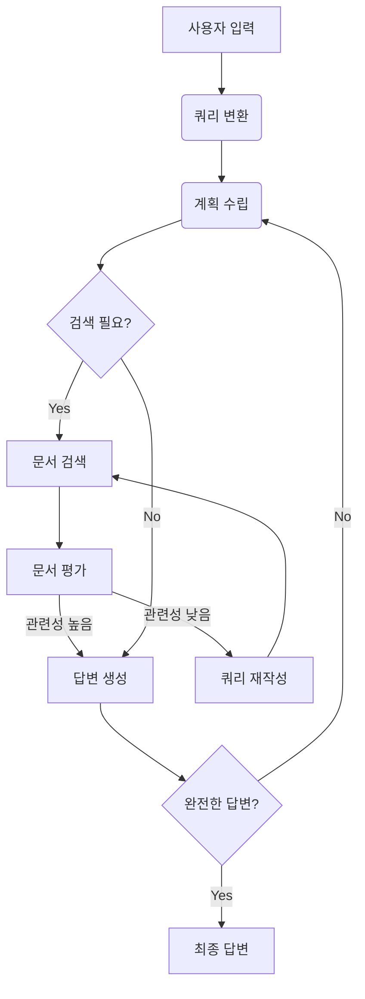

# Agentic Retrieval-Augmented Generation: A Survey on Agentic RAG

## 1. 배경 & 동기
- **LLM 한계**: 훈련 시점 이후 지식 부재 → 최신성·정확성 문제
- **전통 RAG**: 외부 검색 결과를 프롬프트에 넣어 사실 기반 응답 생성
- **문제점**: 단일 패스·고정 흐름이라 복잡한 다단계 추론·계획 수행이 어려움
- **Agentic RAG 제안**: 에이전트가 *검색 ↔ 계획 ↔ 행동* 루프를 자율 반복하여 동적 상황에 대응

---

## 2. 핵심 개념
- **Agent 구성요소**
  - LLM (역할·태스크)
  - 메모리 (단기·장기)
  - Planning 모듈
  - Tool Use 모듈
- **Agentic 패턴**  
  Reflection · Planning · Tool Use · Multi-Agent Collaboration
- **대표 워크플로 템플릿**  
  Prompt Chaining, Routing, Parallelization, Orchestrator-Worker, Evaluator-Optimizer

---

## 3. 아키텍처 분류
1. **Single-Agent RAG**  
   - 단일 라우터가 쿼리마다 최적 데이터소스를 결정
2. **Multi-Agent RAG**  
   - 역할별 에이전트가 병렬·협업 (예: SQL-Agent, Web-Agent)
3. **Hierarchical RAG**  
   - 상위 전략 Agent → 하위 작업 Agent 계층 구조
4. **특화 확장 예시**  
   - Corrective / Adaptive / Graph-Based RAG  
   - Agentic Document Workflow(ADW) 등

---

## 4. 장단점 비교
- **Agentic RAG 장점**
  - 메모리 모듈로 컨텍스트 유지 강화
  - 다단계·자율 계획 가능 → 복잡 추론 지원
  - 멀티-에이전트 병렬 처리로 확장성 ↑
- **단점 / 과제**
  - 오케스트레이션 복잡·비용 증가
  - 평가 지표 및 벤치마크 부족
  - 안전성·통제 메커니즘 필요

---

## 5. 대표 응용 분야
- 고객지원 자동 제안 (예: 광고 세일즈)
- 의료: EHR + 최신 문헌 기반 맞춤 진단
- 법률·계약 검토 및 위험 조항 요약
- 금융 리스크 분석·보험 청구 자동화
- 교육: 학습자 맞춤 교재·피드백 생성

---

## 6. 구현 도구 & 프레임워크
- **Agent Orchestration**: LangGraph, OpenAI Assistants v2, CrewAI
- **Vector DB**: pgvector(Postgres), Weaviate, Azure AI Search
- **Retrieval 유틸**: LlamaIndex(ADW), LangChain Retriever-as-Agent, DSPy
- **Re-ranking**: Cohere ReRank, OpenAI Text Embedding 3 Large/X
- **메모리 SDK**: LangMem, MemGPT, Semantic Router

---

## 7. 한계 & 향후 과제
1. 오케스트레이션 비용 증가 — 멀티-에이전트 조율·모니터링 복잡
2. 동적 워크플로를 반영할 **평가 지표 부족**
3. 자율성 증가에 따른 **안전성·검증·롤백** 메커니즘 필요
4. 대규모 실시간 처리 시 **지연·비용 최적화** 연구 필수

---

> **한 줄 요약**  
> Agentic RAG는 "검색 → 계획 → 행동 → 재검색" 자율 루프를 도입해, 기존 RAG의 정적 한계를 넘어 복잡·동적 태스크에서도 더 정확하고 탄력적인 AI 시스템을 가능하게 한다.

---

# 8. LangGraph를 이용한 Agentic RAG 구현 예제

## 8.1 아키텍처 설계

Agentic RAG를 LangGraph로 구현할 때는 다음과 같은 핵심 구조를 사용합니다:



## 8.2 State 설계

```python
from typing import TypedDict, Annotated, List
import operator
from langchain_core.messages import BaseMessage

class AgenticRAGState(TypedDict):
    # 사용자 입력 관련
    original_query: str
    transformed_query: Annotated[str, operator.add]
    
    # 계획 및 실행 관련
    plan: str
    execution_steps: Annotated[List[str], operator.add]
    current_step: int
    
    # 검색 및 문서 관련
    retrieved_documents: Annotated[List[dict], operator.add]
    relevant_documents: List[dict]
    search_iterations: int
    
    # 답변 생성 관련
    partial_answers: Annotated[List[str], operator.add]
    final_answer: str
    
    # 메타데이터
    iteration_count: int
    confidence_score: float
    messages: Annotated[List[BaseMessage], operator.add]
```

## 8.3 핵심 노드 구현

### 8.3.1 쿼리 변환 노드

```python
from langchain_openai import ChatOpenAI
from langchain_core.prompts import ChatPromptTemplate

def query_transformation_node(state: AgenticRAGState):
    """사용자 쿼리를 검색에 적합한 형태로 변환"""
    
    prompt = ChatPromptTemplate.from_template("""
    당신은 쿼리 변환 전문가입니다. 사용자의 모호한 질문을 명확하고 검색에 최적화된 형태로 변환하세요.

    원본 쿼리: {original_query}
    
    변환 규칙:
    1. 핵심 키워드를 명확히 하세요
    2. 검색에 유용한 동의어나 관련 용어를 추가하세요
    3. 불필요한 감정 표현이나 구어체는 제거하세요
    4. 구체적이고 검색 가능한 형태로 만드세요
    
    변환된 쿼리:
    """)
    
    llm = ChatOpenAI(model="gpt-3.5-turbo", temperature=0)
    chain = prompt | llm
    
    result = chain.invoke({"original_query": state["original_query"]})
    
    return {
        "transformed_query": result.content,
        "messages": [result]
    }
```

### 8.3.2 계획 수립 노드

```python
def planning_node(state: AgenticRAGState):
    """현재 상황을 분석하여 다음 행동 계획을 수립"""
    
    prompt = ChatPromptTemplate.from_template("""
    당신은 연구 계획 전문가입니다. 주어진 질문에 답하기 위한 단계별 계획을 세우세요.

    사용자 질문: {query}
    현재까지 수집된 정보: {current_info}
    
    다음 중 어떤 행동이 필요한지 판단하고 계획을 세우세요:
    1. SEARCH: 추가 정보 검색이 필요한 경우
    2. ANALYZE: 기존 정보 분석이 필요한 경우  
    3. GENERATE: 답변 생성이 가능한 경우
    
    계획:
    """)
    
    llm = ChatOpenAI(model="gpt-4-turbo", temperature=0)
    chain = prompt | llm
    
    current_info = "\n".join([doc.get("content", "") for doc in state.get("relevant_documents", [])])
    
    result = chain.invoke({
        "query": state["transformed_query"],
        "current_info": current_info[:1000]  # 컨텍스트 길이 제한
    })
    
    return {
        "plan": result.content,
        "iteration_count": state.get("iteration_count", 0) + 1
    }
```

### 8.3.3 문서 검색 노드

```python
def retrieval_node(state: AgenticRAGState):
    """Vector DB에서 관련 문서를 검색"""
    
    # 실제 구현에서는 Vector DB 클라이언트를 사용
    # 여기서는 의사코드로 표현
    
    def search_vector_db(query: str, top_k: int = 5):
        # Vector DB 검색 로직
        # 예: ChromaDB, Pinecone, Weaviate 등 사용
        return [
            {"content": "검색된 문서 내용 1", "metadata": {"source": "doc1.pdf", "score": 0.95}},
            {"content": "검색된 문서 내용 2", "metadata": {"source": "doc2.pdf", "score": 0.87}},
            # ...
        ]
    
    query = state["transformed_query"]
    search_results = search_vector_db(query)
    
    return {
        "retrieved_documents": search_results,
        "search_iterations": state.get("search_iterations", 0) + 1
    }
```

### 8.3.4 문서 평가 노드

```python
def document_grading_node(state: AgenticRAGState):
    """검색된 문서의 관련성을 평가하고 필터링"""
    
    prompt = ChatPromptTemplate.from_template("""
    다음 문서가 주어진 질문과 관련이 있는지 평가하세요.

    질문: {query}
    문서 내용: {document}
    
    평가 기준:
    1. 질문에 직접적으로 답할 수 있는 정보가 포함되어 있는가?
    2. 관련 맥락이나 배경 정보를 제공하는가?
    3. 신뢰할 수 있는 출처인가?
    
    관련성 점수 (0-10): 
    이유:
    """)
    
    llm = ChatOpenAI(model="gpt-3.5-turbo", temperature=0)
    chain = prompt | llm
    
    relevant_docs = []
    
    for doc in state["retrieved_documents"]:
        evaluation = chain.invoke({
            "query": state["transformed_query"],
            "document": doc["content"][:500]  # 문서 길이 제한
        })
        
        # 점수 추출 (실제로는 더 정교한 파싱 필요)
        try:
            score = int(evaluation.content.split("관련성 점수")[1].split(":")[1].strip().split()[0])
            if score >= 7:  # 임계값 설정
                doc["relevance_score"] = score
                relevant_docs.append(doc)
        except:
            continue
    
    return {"relevant_documents": relevant_docs}
```

### 8.3.5 답변 생성 노드

```python
def generation_node(state: AgenticRAGState):
    """검색된 관련 문서를 바탕으로 최종 답변 생성"""
    
    prompt = ChatPromptTemplate.from_template("""
    다음 문서들을 참고하여 사용자의 질문에 정확하고 포괄적으로 답변하세요.

    질문: {query}
    
    참고 문서들:
    {documents}
    
    답변 작성 규칙:
    1. 제공된 문서의 정보만을 사용하세요
    2. 출처를 명시하세요
    3. 확실하지 않은 정보는 "문서에 따르면..."과 같이 표현하세요
    4. 구체적이고 실용적인 답변을 제공하세요
    
    답변:
    """)
    
    llm = ChatOpenAI(model="gpt-4-turbo", temperature=0.2)
    chain = prompt | llm
    
    # 관련 문서들을 텍스트로 조합
    documents_text = ""
    for i, doc in enumerate(state["relevant_documents"]):
        documents_text += f"\n[문서 {i+1}] (출처: {doc['metadata']['source']})\n{doc['content']}\n"
    
    result = chain.invoke({
        "query": state["transformed_query"],
        "documents": documents_text[:3000]  # 컨텍스트 길이 제한
    })
    
    return {"final_answer": result.content}
```

## 8.4 조건부 엣지 구현

```python
def should_retrieve(state: AgenticRAGState) -> str:
    """검색이 필요한지 판단하는 라우팅 함수"""
    
    # 최대 반복 횟수 체크
    if state.get("iteration_count", 0) > 5:
        return "generate"
    
    # 이미 충분한 문서가 있는지 체크
    if len(state.get("relevant_documents", [])) >= 3:
        return "generate"
    
    # 계획에서 SEARCH가 포함되어 있는지 체크
    plan = state.get("plan", "").lower()
    if "search" in plan or "검색" in plan:
        return "retrieve"
    elif "generate" in plan or "생성" in plan:
        return "generate"
    else:
        return "retrieve"  # 기본값

def should_rewrite_query(state: AgenticRAGState) -> str:
    """쿼리를 재작성할지 판단하는 라우팅 함수"""
    
    relevant_docs = state.get("relevant_documents", [])
    
    # 관련 문서가 충분히 있으면 생성으로
    if len(relevant_docs) >= 2:
        return "generate"
    
    # 검색 시도 횟수가 너무 많으면 생성으로 (실패 처리)
    if state.get("search_iterations", 0) >= 3:
        return "generate"
    
    # 그 외에는 쿼리 재작성
    return "rewrite"

def is_answer_complete(state: AgenticRAGState) -> str:
    """답변이 완전한지 판단하는 라우팅 함수"""
    
    if not state.get("final_answer"):
        return "plan"
    
    # 답변 품질 평가 (간단한 예시)
    answer = state["final_answer"]
    if len(answer) < 50:  # 너무 짧은 답변
        return "plan"
    
    return "end"
```

## 8.5 그래프 구성 및 실행

```python
from langgraph.graph import StateGraph, END
from langgraph.checkpoint.memory import MemorySaver

def create_agentic_rag_graph():
    """Agentic RAG 그래프 생성"""
    
    # 그래프 생성
    workflow = StateGraph(AgenticRAGState)
    
    # 노드 추가
    workflow.add_node("transform_query", query_transformation_node)
    workflow.add_node("plan", planning_node)
    workflow.add_node("retrieve", retrieval_node)
    workflow.add_node("grade_documents", document_grading_node)
    workflow.add_node("generate", generation_node)
    workflow.add_node("rewrite_query", lambda state: {
        "transformed_query": state["transformed_query"] + " 추가검색어"
    })
    
    # 시작점 설정
    workflow.set_entry_point("transform_query")
    
    # 엣지 연결
    workflow.add_edge("transform_query", "plan")
    
    workflow.add_conditional_edges(
        "plan",
        should_retrieve,
        {
            "retrieve": "retrieve",
            "generate": "generate"
        }
    )
    
    workflow.add_edge("retrieve", "grade_documents")
    
    workflow.add_conditional_edges(
        "grade_documents",
        should_rewrite_query,
        {
            "generate": "generate",
            "rewrite": "rewrite_query"
        }
    )
    
    workflow.add_edge("rewrite_query", "plan")
    
    workflow.add_conditional_edges(
        "generate",
        is_answer_complete,
        {
            "plan": "plan",
            "end": END
        }
    )
    
    # 메모리 추가
    memory = MemorySaver()
    
    # 그래프 컴파일
    app = workflow.compile(checkpointer=memory)
    
    return app

# 사용 예시
def main():
    app = create_agentic_rag_graph()
    
    # 초기 상태
    initial_state = {
        "original_query": "LangGraph와 기존 RAG의 차이점은 무엇인가요?",
        "iteration_count": 0,
        "search_iterations": 0,
        "retrieved_documents": [],
        "relevant_documents": [],
        "messages": []
    }
    
    # 실행 설정
    config = {"configurable": {"thread_id": "user_123"}}
    
    # 스트리밍 실행
    for event in app.stream(initial_state, config):
        for node_name, output in event.items():
            print(f"--- {node_name} ---")
            if "final_answer" in output:
                print(f"최종 답변: {output['final_answer']}")
            elif "plan" in output:
                print(f"계획: {output['plan']}")
            elif "retrieved_documents" in output:
                print(f"검색된 문서 수: {len(output['retrieved_documents'])}")

if __name__ == "__main__":
    main()
```

## 8.6 성능 최적화 팁

### 8.6.1 State 최적화
```python
# ❌ 비효율적: 모든 문서를 State에 저장
class BadState(TypedDict):
    all_documents: List[str]  # 매번 전체 문서가 전달됨

# ✅ 효율적: 필요한 정보만 저장
class GoodState(TypedDict):
    document_ids: List[str]  # ID만 저장하고 필요시 별도 조회
    current_context: str     # 현재 단계에 필요한 컨텍스트만
```

### 8.6.2 프롬프트 최적화
```python
# Few-shot 예시를 포함한 고품질 프롬프트
ENHANCED_PLANNING_PROMPT = """
당신은 연구 계획 전문가입니다. 다음 예시를 참고하여 효율적인 계획을 세우세요.

예시 1:
질문: "딥러닝의 최신 트렌드는?"
계획: SEARCH - "deep learning trends 2024", "neural network innovations"
      ANALYZE - 기술 발전 패턴 분석
      GENERATE - 주요 트렌드 요약

예시 2:
질문: "파이썬으로 API 만드는 방법"
계획: SEARCH - "Python API development FastAPI Flask"
      SEARCH - "REST API best practices"
      GENERATE - 단계별 구현 가이드

현재 질문: {query}
계획:
"""
```

### 8.6.3 비용 최적화
```python
def cost_optimized_llm_selection(task_type: str):
    """작업 유형에 따른 최적 모델 선택"""
    if task_type == "planning":
        return ChatOpenAI(model="gpt-4-turbo")  # 복잡한 추론
    elif task_type == "classification":
        return ChatOpenAI(model="gpt-3.5-turbo")  # 단순 분류
    elif task_type == "generation":
        return ChatOpenAI(model="gpt-4-turbo")  # 고품질 생성
    else:
        return ChatOpenAI(model="gpt-3.5-turbo")  # 기본값
```

이러한 구현을 통해 LangGraph를 이용한 강력한 Agentic RAG 시스템을 구축할 수 있습니다. 핵심은 **적절한 State 설계**, **명확한 역할 분리**, **효율적인 라우팅 로직**입니다.