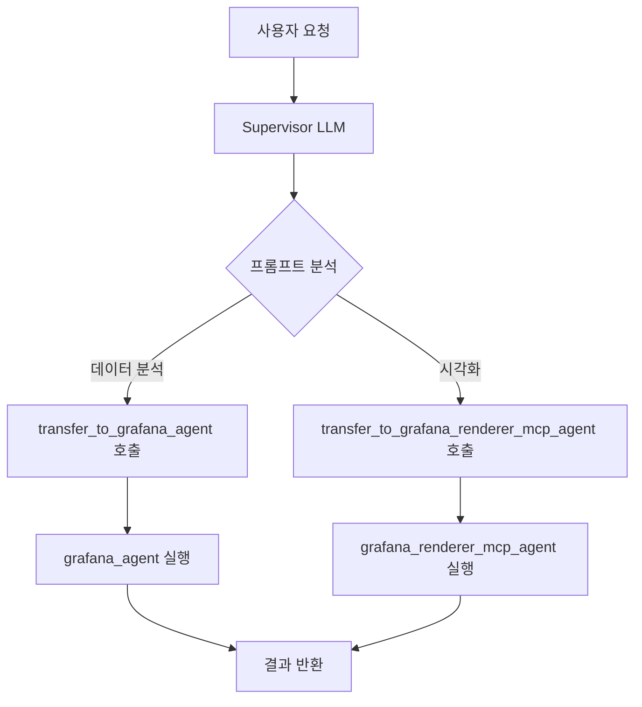

# LangGraph Supervisor 에이전트 선택 방식

## 📋 개요

`langgraph_supervisor` 패키지는 **Tool Function Calling**을 통해 여러 worker 에이전트 중에서 적절한 에이전트를 지능적으로 선택하는 Supervisor-Worker 패턴을 구현합니다.

## 🎯 핵심 메커니즘: Tool-based Handoff

### 1. Handoff Tool 자동 생성

각 에이전트마다 자동으로 handoff tool이 생성됩니다:

```python
handoff_tools = [
    create_handoff_tool(
        agent_name="grafana_agent",
        name="transfer_to_grafana_agent", 
        description="Ask agent 'grafana_agent' for help"
    ),
    create_handoff_tool(
        agent_name="grafana_renderer_mcp_agent",
        name="transfer_to_grafana_renderer_mcp_agent",
        description="Ask agent 'grafana_renderer_mcp_agent' for help"
    )
]
```

### 2. Tool 호출을 통한 라우팅

LLM이 프롬프트를 분석하여 적절한 `transfer_to_*` 도구를 호출하면, 해당 에이전트로 제어권이 이동됩니다.

## 🔄 선택 과정

### 단계별 흐름

1. **LLM이 프롬프트를 분석**
   ```python
   SUPERVISOR_PROMPT = """
   grafana_agent: Grafana 데이터 분석, 메트릭 조회가 필요할 때 사용
   grafana_renderer_mcp_agent: 대시보드 시각화 및 렌더링이 필요할 때 사용
   """
   ```

2. **LLM이 적절한 Tool을 호출**
   - 사용자: "Grafana 대시보드 목록을 보여주세요"
   - LLM: `transfer_to_grafana_renderer_mcp_agent()` 도구 호출

3. **Handoff 실행**
   ```python
   return Command(
       goto=agent_name,  # "grafana_renderer_mcp_agent"로 이동
       graph=Command.PARENT,
       update={**state, "messages": handoff_messages}
   )
   ```

## 💡 프롬프트의 역할

현재 `supervisor.py`의 `SUPERVISOR_PROMPT`가 **에이전트 선택의 핵심**입니다:

```python
SUPERVISOR_PROMPT = """
너는 Grafana 모니터링 시스템의 Supervisor Agent입니다.
사용자의 요청을 분석하고 적절한 전문 에이전트에게 작업을 배분하는 역할을 담당합니다.

grafana_agent: Grafana 데이터 분석, 메트릭 조회, 모니터링 정보 제공이 필요할 때 사용합니다.
  * 시스템 메트릭 분석 (CPU, 메모리, 디스크)
  * 애플리케이션 성능 분석 (응답시간, 에러율)
  * HTTP 상태 코드 분석 (2xx, 4xx, 5xx)
  * 서비스 상태 및 가용성 확인
  * 로그 분석 및 패턴 감지
  * 대시보드 데이터 조회 및 분석

grafana_renderer_mcp_agent: Grafana 대시보드 시각화 및 렌더링이 필요할 때 사용합니다.
  * 대시보드 이미지, 차트 캡처, 시각화 요청
  * 대시보드 보여줘, CPU 차트 캡처해줘, 그래프 이미지 만들어줘
  * 대시보드 스크린샷 및 리포트 생성

사용자의 요청을 신중히 분석하고, 가장 적절한 에이전트를 선택하세요.
"""
```

## 🌊 실제 동작 흐름



## 📊 선택 기준

LLM(Gemini)이 다음을 기반으로 판단합니다:

### 주요 판단 요소
- **프롬프트의 역할 정의**: 각 에이전트의 전문 분야
- **사용자 요청의 의도**: 분석 vs 시각화 vs 조회
- **키워드 매칭**: "분석", "차트", "스크린샷", "목록" 등

### 판단 로직
| 요청 유형 | 키워드 예시 | 선택 에이전트 |
|-----------|-------------|---------------|
| 데이터 분석 | "분석해줘", "상태 확인", "메트릭 조회" | `grafana_agent` |
| 시각화/렌더링 | "보여줘", "스크린샷", "차트", "대시보드" | `grafana_renderer_mcp_agent` |

## 📝 실제 예시

### 1. 데이터 분석 요청
```
사용자: "CPU 사용량을 분석해주세요"
→ LLM: transfer_to_grafana_agent() 호출
→ grafana_agent가 메트릭 분석 수행
```

### 2. 시각화 요청
```
사용자: "대시보드 스크린샷을 찍어주세요"
→ LLM: transfer_to_grafana_renderer_mcp_agent() 호출
→ grafana_renderer_mcp_agent가 이미지 생성
```

### 3. 목록 조회 요청
```
사용자: "대시보드 목록을 보여주세요"
→ LLM: transfer_to_grafana_renderer_mcp_agent() 호출
→ grafana_renderer_mcp_agent가 목록 조회 (실제 디버깅 결과)
```

## 🚀 장점

### 1. 지능적 라우팅
- **LLM의 자연어 이해 능력**을 활용한 동적 판단
- 복잡한 규칙 기반 라우팅 불필요

### 2. 확장성
- 새로운 에이전트 추가 시 프롬프트만 수정하면 됨
- Tool 자동 생성으로 개발 부담 최소화

### 3. 유연성
- 사용자 요청의 미묘한 차이도 인식 가능
- 컨텍스트 기반 에이전트 선택

### 4. 투명성
- Tool 호출 로그를 통해 선택 이유 추적 가능
- 디버깅 및 모니터링 용이

## ⚙️ 구현 코드

### Supervisor 생성
```python
from langgraph_supervisor import create_supervisor

# 에이전트들 생성
agents = await create_agents()

# Supervisor 그래프 생성
supervisor_graph_builder = create_supervisor(
    agents=agents,
    model=llm,
    prompt=SUPERVISOR_PROMPT,
    output_mode='full_history'
)

# 컴파일
compiled_graph = supervisor_graph_builder.compile()
```

### 사용법
```python
# 입력 메시지
input_data = {"messages": [HumanMessage(content="대시보드를 보여주세요")]}

# 실행
result = await compiled_graph.ainvoke(input_data)
```

## 🔧 커스터마이징

### 프롬프트 수정
에이전트 선택 로직을 변경하려면 `SUPERVISOR_PROMPT`를 수정하세요:

```python
SUPERVISOR_PROMPT = """
새로운 역할 정의...
agent_name: 역할 설명 및 사용 조건
"""
```

### 에이전트 추가
새로운 에이전트를 추가하려면:
1. 에이전트 생성
2. `create_agents()` 함수에 추가
3. `SUPERVISOR_PROMPT`에 역할 정의 추가

이 방식을 통해 **확장 가능하고 지능적인 멀티 에이전트 시스템**을 구축할 수 있습니다! 🎯
