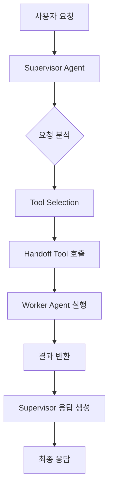
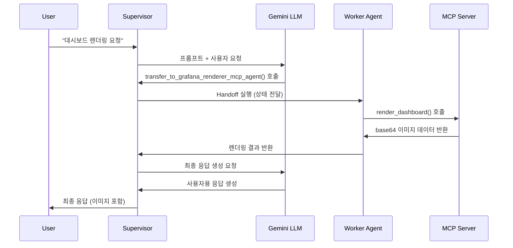

# 🤖 LangGraph Supervisor-Worker Handoff 메커니즘

## 📋 개요

LangGraph의 Supervisor-Worker 패턴은 **Tool-based Handoff** 메커니즘을 통해 작업을 분산 처리하는 아키텍처입니다. Supervisor가 사용자 요청을 분석하여 적절한 Worker 에이전트를 선택하고, 작업을 위임한 후 결과를 받아 최종 응답을 생성합니다.

## 🏗️ 전체 아키텍처



## 🔄 Handoff 과정 상세 분석

### 1단계: 초기화 및 그래프 구성

```python
# 1. Worker 에이전트들 생성
agents = await create_enhanced_agents()  # [grafana_agent, grafana_renderer_mcp_agent]

# 2. Supervisor 그래프 생성
supervisor_graph = create_supervisor(
    agents=agents,
    model=llm,
    prompt=dynamic_prompt,
    output_mode='full_history'
)

# 3. 자동 Handoff Tool 생성
# - transfer_to_grafana_agent
# - transfer_to_grafana_renderer_mcp_agent
```

### 2단계: 사용자 요청 접수 및 상태 초기화

```python
# 입력 메시지 생성
input_data = {
    "messages": [HumanMessage(content="Node Exporter Full 대시보드를 렌더링해주세요")],
    "sender": "user"
}

# 그래프 실행 시작
result = await graph.ainvoke(input_data, config)
```

### 3단계: Supervisor의 요청 분석

```python
# Supervisor 프롬프트 분석
SUPERVISOR_PROMPT = """
사용 가능한 전문 에이전트들:
- grafana_agent: 데이터 분석, 메트릭 조회
- grafana_renderer_mcp_agent: 대시보드 렌더링 및 시각화

선택 가이드라인:
1. 대시보드 렌더링 요청 → grafana_renderer_mcp_agent
2. 데이터 분석 요청 → grafana_agent
"""

# LLM이 요청 분석
# "렌더링" 키워드 감지 → grafana_renderer_mcp_agent 선택
```

### 4단계: Handoff Tool 호출

```python
# LLM이 적절한 Tool 선택 및 호출
tool_call = {
    "name": "transfer_to_grafana_renderer_mcp_agent",
    "args": {}
}

# Handoff Tool 실행
def handoff_tool():
    return Command(
        goto="grafana_renderer_mcp_agent",  # 제어권 이동
        graph=Command.PARENT,               # 부모 그래프에서 실행
        update={                           # 상태 업데이트
            "messages": current_messages + [tool_message],
            "active_agent": "grafana_renderer_mcp_agent"
        }
    )
```

### 5단계: Worker Agent 실행

```python
# grafana_renderer_mcp_agent로 제어권 이동
async def grafana_renderer_mcp_agent(state):
    """Grafana 렌더링 전용 에이전트"""
    
    # 1. MCP 도구들 로드
    tools = await get_mcp_tools()  # list_dashboards, render_dashboard
    
    # 2. 사용자 요청 처리
    # "Node Exporter Full 대시보드를 렌더링해주세요"
    
    # 3. 대시보드 검색
    dashboards = await list_dashboards()
    
    # 4. 대시보드 렌더링 실행
    dashboard_uid = find_dashboard_uid("Node Exporter Full")
    image_data = await render_dashboard(dashboard_uid)
    
    # 5. 결과 반환
    return {
        "messages": [
            AIMessage(content=f"Node Exporter Full 대시보드 렌더링 완료\n{image_data}")
        ]
    }
```

### 6단계: 결과 취합 및 최종 응답

```python
# Worker 결과를 Supervisor가 받음
worker_result = {
    "messages": [AIMessage(content="렌더링 완료 + base64 이미지 데이터")]
}

# Supervisor가 최종 응답 생성
final_response = await supervisor_llm.ainvoke([
    SystemMessage("Worker의 결과를 사용자에게 적절히 전달하세요"),
    *worker_result["messages"]
])

# 최종 상태 반환
return {
    "messages": all_messages + [final_response],
    "active_agent": "supervisor",
    "final_response": final_response.content
}
```

## 🛠️ 핵심 구성 요소

### 1. Handoff Tool 자동 생성

```python
def create_handoff_tool(agent_name: str, description: str = None):
    """에이전트별 handoff tool 자동 생성"""
    
    @tool(name=f"transfer_to_{agent_name}")
    def handoff_to_agent(state: dict, tool_call_id: str):
        tool_message = ToolMessage(
            content=f"Successfully transferred to {agent_name}",
            tool_call_id=tool_call_id,
        )
        
        return Command(
            goto=agent_name,
            graph=Command.PARENT,
            update={
                "messages": state["messages"] + [tool_message],
                "active_agent": agent_name
            }
        )
    
    return handoff_to_agent
```

### 2. 상태 관리

```python
class SupervisorState(TypedDict):
    """Supervisor-Worker 상태 스키마"""
    messages: List[BaseMessage]      # 전체 대화 히스토리
    active_agent: str               # 현재 활성 에이전트
    sender: str                     # 마지막 메시지 발신자
    handoff_count: int             # Handoff 횟수 (순환 방지)
```

### 3. 실행 흐름 제어

```python
# 그래프 노드 구성
workflow = StateGraph(SupervisorState)

# Supervisor 노드
workflow.add_node("supervisor", supervisor_node)

# Worker 노드들
workflow.add_node("grafana_agent", grafana_agent)
workflow.add_node("grafana_renderer_mcp_agent", grafana_renderer_mcp_agent)

# 조건부 엣지 (Handoff 로직)
workflow.add_conditional_edges(
    "supervisor",
    route_to_worker,  # Handoff Tool 호출 결과에 따라 라우팅
    {
        "grafana_agent": "grafana_agent",
        "grafana_renderer_mcp_agent": "grafana_renderer_mcp_agent",
        "END": END
    }
)
```

## 📊 실행 시퀀스 다이어그램



## 🔍 디버깅 및 모니터링

### 1. 상태 추적

```python
# 각 단계별 상태 로깅
logger.info(f"Current agent: {state['active_agent']}")
logger.info(f"Message count: {len(state['messages'])}")
logger.info(f"Last message: {state['messages'][-1].content[:100]}...")
```

### 2. Tool 호출 추적

```python
# Tool 호출 모니터링
def track_tool_calls(state):
    tool_calls = [msg for msg in state['messages'] 
                  if isinstance(msg, ToolMessage)]
    logger.info(f"Tool calls executed: {len(tool_calls)}")
    for call in tool_calls:
        logger.info(f"  - {call.name}: {call.content}")
```

### 3. 성능 측정

```python
import time

def measure_execution_time(func):
    async def wrapper(*args, **kwargs):
        start_time = time.time()
        result = await func(*args, **kwargs)
        execution_time = time.time() - start_time
        logger.info(f"Execution time: {execution_time:.2f}s")
        return result
    return wrapper
```

## 🚀 최적화 팁

### 1. 프롬프트 최적화
- 명확한 에이전트 역할 정의
- 구체적인 키워드 기반 라우팅 규칙
- 예외 상황 처리 가이드라인

### 2. 상태 관리 최적화
- 불필요한 메시지 히스토리 정리
- 대용량 데이터 분리 저장
- 순환 handoff 방지 로직

### 3. 에러 처리
- Worker 에이전트 실패 시 fallback
- Timeout 설정
- 재시도 메커니즘

## 💡 주요 장점

1. **모듈성**: 각 Worker는 독립적으로 개발/배포 가능
2. **확장성**: 새로운 Worker 추가가 용이
3. **유연성**: 동적 라우팅 규칙 변경 가능
4. **추적성**: 전체 실행 과정 모니터링 가능
5. **재사용성**: Worker를 다른 Supervisor에서도 활용 가능

이 구조를 통해 복잡한 작업을 전문화된 에이전트들이 협력하여 처리할 수 있으며, 각 에이전트의 역할이 명확히 분리되어 유지보수성이 향상됩니다.
