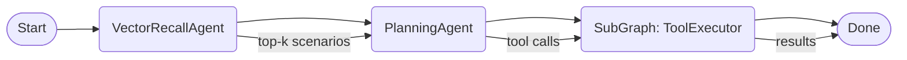

# Backend Design – FastAPI, LangGraph

> 목적: LangGraph 로 작성한 **DevOps Supervisor Agent** 를 FastAPI 서비스로 패키징·배포한다. 
> 
> 참고 문서: [LangGraph Concepts](https://langchain-ai.github.io/langgraph/concepts/), [Persistence](https://langchain-ai.github.io/langgraph/concepts/persistence/), [Platform Architecture](https://langchain-ai.github.io/langgraph/concepts/platform_architecture/)

---

## 1. Tech Stack

| Layer | Library / Service | 비고 |
|-------|-------------------|------|
| Web API | **FastAPI** + Uvicorn | ASGI, Streaming 지원 |
| Agent Framework | **LangGraph v0.x** | StateGraph API + Functional API 혼합 |
| LLM | Gemini-Pro / GPT-4o | OpenAI 혹은 Google Vertex |
| Persistence & Checkpointer | **Postgres (+ pgvector)** | run/state + 벡터 DB(Embedding) 일원화 |
| Embedding | **LangChain Embeddings** | OpenAIEmbeddings or HuggingFace |
| Container | Docker + docker-compose | Local dev / CI 환경 |

---

## 2. Directory Layout (Updated)

```
backend/
├── app/
│   ├── main.py
│   ├── core/
│   │   └── config.py
│   ├── api/
│   │   └── v1/
│   │       ├── agent.py        # /agent/* endpoints
│   │       ├── scenario.py     # /scenarios/* (upload/search)
│   │       └── health.py
│   ├── graph/
│   │   ├── supervisor.py
│   │   ├── subgraphs/
│   │   └── memory.py           # VectorRecallAgent / ConversationMemoryAgent
│   ├── agents/                 # PlanningAgent, GuardrailAgent 래퍼
│   ├── tools/
│   ├── repositories/           # Postgres access layer (run, scenario)
│   ├── schemas/
│   └── services/              # EmbeddingService, ScenarioService
└── ... (생략)
```

### 2-1. API Surface (추가)

| Method & Path | 기능 |
|---------------|-----|
| `POST /api/v1/agent/run` | Supervisor Graph 실행 요청 |
| `GET  /api/v1/agent/stream/{run_id}` | Run 실시간 스트리밍 |
| `POST /api/v1/scenarios/upload` | DevOps 시나리오 JSON 업로드 & 임베딩 저장 |
| `POST /api/v1/scenarios/search` | 유사 시나리오 top-k 검색 (pgvector cosine) |

---

## 3. 핵심 구성요소 (보강)

| Module | 역할 | LangGraph 참고 |
|--------|------|---------------|
| `PlanningAgent` | LLM 기반 도구 호출 플래닝 | Pre-built `PlanningAgent` |
| `VectorRecallAgent` | pgvector 내 시나리오 RAG 검색 | Pre-built `VectorRecallAgent` |
| `StateGraph` (Supervisor) | DevOps DAG 정의 | [Agent Architectures] |
| `ConversationMemoryAgent` | 휴먼-대화 요약 메모리 | Pre-built `ConversationMemoryAgent` |
| `GuardrailAgent` (선택) | 안전·정책 검사 | `GuardrailAgent` |

---

## 4. Vector DB Workflow

1. **시나리오 업로드**
   - `/scenarios/upload` 에 JSON 시나리오 POST
   - `EmbeddingService` 가 `goal + conditions` 필드를 임베딩 → pgvector 테이블 `scenario_embeddings`
2. **에이전트 실행 시 (Supervisor Graph 내부)**
   - **`VectorRecallAgent` 노드**가 입력된 *goal* 과 유사도 검색 → top-k 시나리오 반환
   - Supervisor 가 이 결과를 **`PlanningAgent`** 노드의 컨텍스트로 전달하여 세부 도구 호출 플랜 작성
3. **Planning & Execution**
   - 이후 노드들이 도구 실행 → 결과를 FastAPI 스트리밍

---

## 5. Packaging & Deployment (변경사항 반영)

| Stage | 내용 |
|-------|-----|
| **Local Dev** | docker-compose 서비스: fastapi, **postgres (pgvector extension)** |
| **CI** | pytest → langgraph build → Docker build & push |
| **Prod** | Helm Chart 또는 LangGraph Platform(Plus) 배포 |

---

## 6. Updated Dependency List
```
fastapi
uvicorn[standard]
langgraph>=0.x
langchain
openai
psycopg2-binary
pgvector
python-dotenv
pydantic
pytest
```

---

> ✅ agent_system_design.md 의 *Vector DB Knowledge Base*, *PlanningAgent*, *VectorRecallAgent* 요소를 반영하여, FastAPI 백엔드가 시나리오 RAG 검색 → 플래닝 → 실행 흐름을 지원하도록 설계를 보강했습니다.

## 📊 High-Level Architecture (Mermaid)

```mermaid
flowchart TD
    subgraph Client
        A[Operator / CI Pipeline]
    end

    subgraph FastAPI Service
        B[POST /agent/run] -->|async| C(Supervisor StateGraph)
        A --> B
        C -->|SSE| D[GET /agent/stream/{run_id}]
        A <-- D
        A --> E[POST /scenarios/upload]
        A --> F[POST /scenarios/search]
    end

    subgraph Postgres
        G[(runs/state)]
        H[(scenario_embeddings pgvector)]
    end

    C -->|persist| G
    E -->|store embedding| H
    C -->|VectorRecallAgent| H
```

---

## 🧭 Supervisor Graph (Mermaid)



> 위 그래프는 LangGraph `StateGraph` 노드 구성을 단순화하여 표시합니다.
