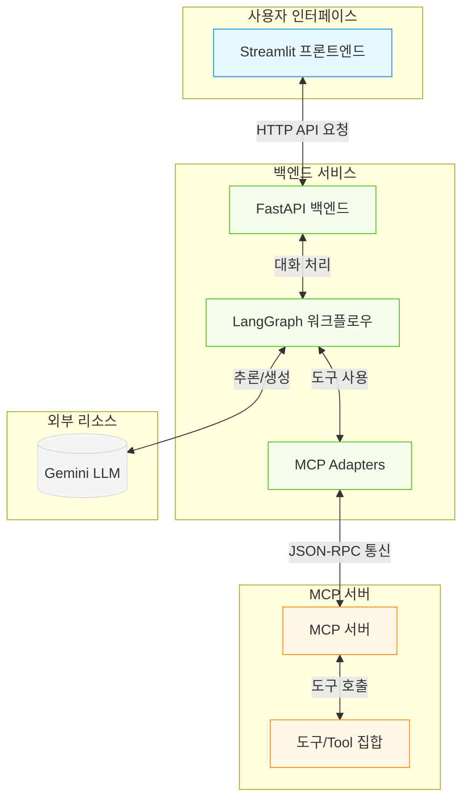
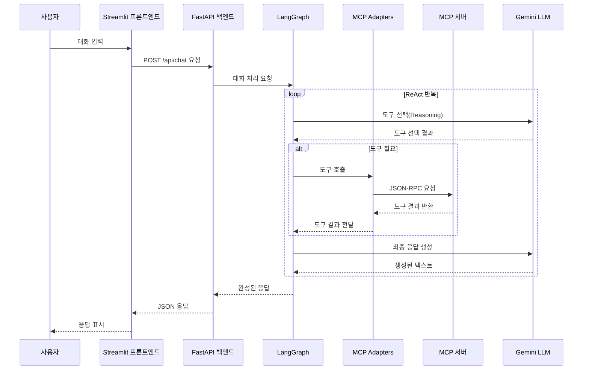
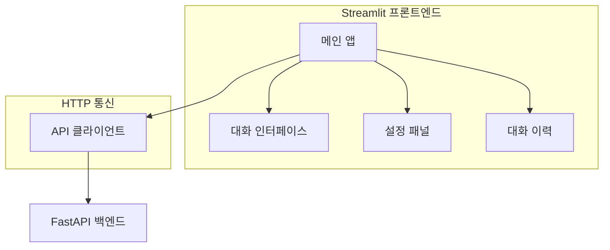
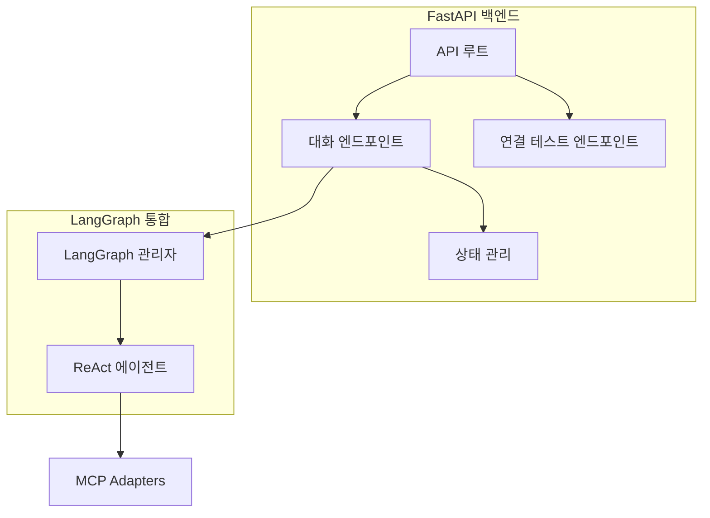
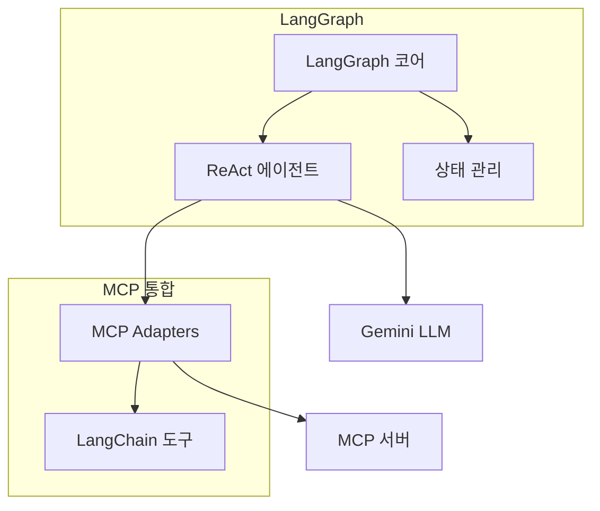
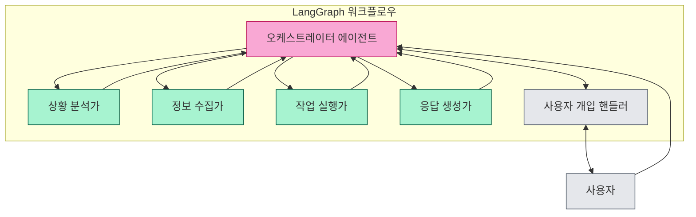
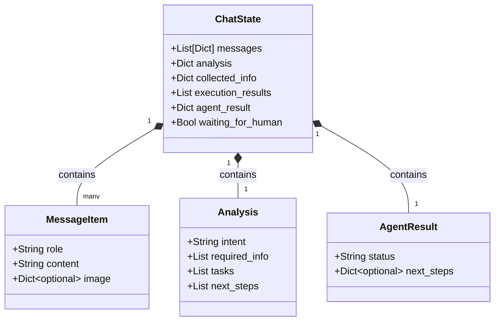
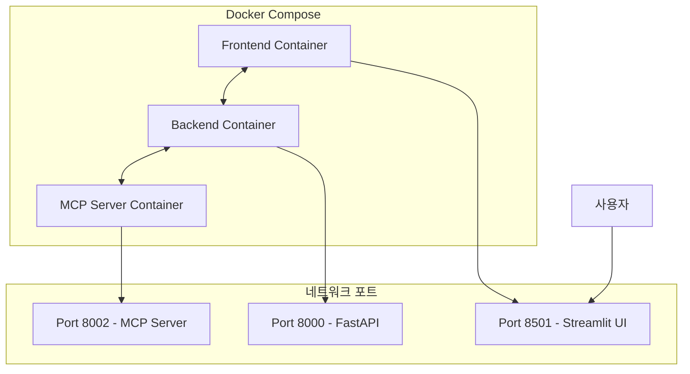

# 챗봇 시스템 아키텍처

이 문서는 Streamlit과 FastAPI로 구성된 챗봇 시스템 아키텍처에 대한 설명을 담고 있습니다. 시스템은 LangGraph와 MCP(Model Context Protocol) 도구를 활용하여 강력한 대화형 인터페이스를 제공합니다.

## 전체 시스템 구성



## 주요 구성 요소

### 1. 프론트엔드 (Streamlit)
- 사용자 인터페이스 제공
- 대화 이력 표시 및 관리
- 사용자 설정 컨트롤(MCP 서버 URL, 타임아웃 등)
- HTTP를 통해 백엔드 API와 통신

### 2. 백엔드 (FastAPI)
- REST API 엔드포인트 제공
- LangGraph 워크플로우 실행 및 관리
- 대화 컨텍스트 및 상태 관리
- MCP 클라이언트 통합

### 3. LangGraph
- ReAct 에이전트 패턴 구현
- LLM을 사용한 추론 과정 관리
- MCP 도구를 LangChain 도구로 변환하여 사용
- 체크포인팅 및 워크플로우 상태 유지

### 4. MCP 서버
- 도구(Tool) 집합 제공
- JSON-RPC 2.0 프로토콜 기반 통신
- 확장 가능한 도구 인터페이스

## 데이터 흐름 다이어그램



## 컴포넌트 상세 분석

### Streamlit 프론트엔드

Streamlit 프론트엔드는 사용자가 챗봇과 상호작용할 수 있는 웹 인터페이스를 제공합니다.



주요 기능:
- 대화 입력 및 표시
- 대화 이력 관리
- 서버 설정 관리 (MCP 서버 URL, 타임아웃 등)
- 이미지 렌더링 지원

### FastAPI 백엔드

FastAPI 백엔드는 RESTful API를 통해 프론트엔드와 통신하고 LangGraph를 실행합니다.



주요 기능:
- 채팅 API 제공 (`/api/chat`)
- 연결 테스트 API 제공 (`/api/connection_test`)
- 대화 이력 및 상태 관리
- LangGraph와 MCP 서버 연결 처리

### LangGraph & MCP 통합

LangGraph와 MCP 통합 계층은 LLM 기반 에이전트와 외부 도구를 연결합니다.



주요 기능:
- ReAct 패턴 기반 에이전트 구현
- MCP 도구를 LangChain 도구로 변환
- 도구 선택 및 실행 로직
- LLM과의 통합

# LangGraph 에이전트 아키텍처

이 섹션에서는 프로젝트의 LangGraph 기반 에이전트 아키텍처를 상세히 설명합니다. 구현에는 오케스트레이터(Orchestrator) 패턴을 중심으로 여러 전문 에이전트를 활용합니다.

## 오케스트레이터-전문가 패턴



### 오케스트레이터 에이전트

오케스트레이터 에이전트는 워크플로우의 중앙 제어 역할을 담당합니다. 전체 대화 흐름을 관리하고, 각 전문 에이전트에게 작업을 할당하며, 전문가 간 핸드오프를 조정합니다.

**주요 책임:**
- 사용자 의도 분석 및 분류
- 적절한 전문가 에이전트 선택
- 에이전트 간 전환 관리 (Command 객체 활용)
- 전체 작업 조정 및 진행 상황 추적
- 필요 시 사용자 개입 요청

**구현:**
```python
def orchestrator(state):
    # 상태에서 필요한 정보 추출
    messages = state["messages"]
    user_input = messages[-1]["content"] if messages[-1]["role"] == "user" else None
    
    # 의도 분석 및 다음 에이전트 결정
    if user_input:
        # 다음 에이전트 결정 로직
        if needs_analysis(user_input):
            return {"next": "situation_analyzer"}
        elif needs_information(user_input):
            return {"next": "information_gatherer"}
        elif needs_execution(user_input):
            return {"next": "task_executor"}
        else:
            return {"next": "response_generator"}
    
    # 이전 에이전트의 결과 처리
    prev_agent_result = state.get("agent_result", {})
    if prev_agent_result.get("status") == "needs_human_input":
        return {"next": "human_intervention_handler"}
    elif prev_agent_result.get("status") == "complete":
        return {"next": "response_generator"}
    
    # 기본값
    return {"next": "response_generator"}
```

### 전문가 에이전트

#### 1. 상황 분석가 (Situation Analyzer)

대화 맥락을 분석하고 사용자의 의도와 요구사항을 해석합니다.

**주요 책임:**
- 사용자 요청 분석
- 현재 대화 컨텍스트 평가
- 필요한 정보/도구 식별
- 구체적 실행 계획 수립

**구현:**
```python
def situation_analyzer(state):
    messages = state["messages"]
    
    # 분석 작업 수행
    analysis_result = analyze_user_query(messages)
    
    # 상태 업데이트
    return {
        "analysis": analysis_result,
        "agent_result": {
            "status": "complete",
            "next_steps": analysis_result["next_steps"]
        },
        "next": "orchestrator"  # 다시 오케스트레이터로 제어 반환
    }
```

#### 2. 정보 수집가 (Information Gatherer)

사용자 질문에 답하기 위해 필요한 정보를 수집합니다.

**주요 책임:**
- 외부 API 호출
- 문서/지식베이스 검색
- 데이터 수집 및 전처리
- 수집된 정보 구조화

**구현:**
```python
def information_gatherer(state):
    analysis = state.get("analysis", {})
    required_info = analysis.get("required_info", [])
    
    # 필요한 정보 수집
    collected_info = {}
    for info in required_info:
        if info["type"] == "web_search":
            collected_info[info["name"]] = search_web(info["query"])
        elif info["type"] == "database":
            collected_info[info["name"]] = query_database(info["query"])
        # 추가 정보 수집 유형
    
    # 상태 업데이트
    return {
        "collected_info": collected_info,
        "agent_result": {"status": "complete"},
        "next": "orchestrator"
    }
```

#### 3. 작업 실행가 (Task Executor)

실제 작업을 수행하거나 도구를 호출합니다.

**주요 책임:**
- MCP 도구 호출
- 실행 결과 평가
- 오류 처리 및 재시도
- 중간 결과 저장

**구현:**
```python
def task_executor(state):
    analysis = state.get("analysis", {})
    tasks = analysis.get("tasks", [])
    
    # 작업 실행
    results = []
    for task in tasks:
        if task["type"] == "mcp_tool":
            # MCP 도구 호출
            tool_result = call_mcp_tool(
                tool_name=task["tool"],
                params=task["params"]
            )
            results.append({
                "task_id": task["id"],
                "result": tool_result,
                "status": "success" if tool_result else "error"
            })
    
    # 작업 결과 평가
    needs_human = any(r["status"] == "error" for r in results)
    
    # 상태 업데이트
    return {
        "execution_results": results,
        "agent_result": {
            "status": "needs_human_input" if needs_human else "complete"
        },
        "next": "orchestrator"
    }
```

#### 4. 응답 생성가 (Response Generator)

수집된 정보와 실행 결과를 바탕으로 사용자에게 전달할 최종 응답을 생성합니다.

**주요 책임:**
- 정보 및 결과 통합
- 응답 형식 지정
- 명확하고 도움이 되는 답변 생성
- 이미지/표 등 시각 자료 포함(필요시)

**구현:**
```python
def response_generator(state):
    analysis = state.get("analysis", {})
    collected_info = state.get("collected_info", {})
    execution_results = state.get("execution_results", [])
    
    # 응답 생성 컨텍스트 구성
    context = {
        "analysis": analysis,
        "information": collected_info,
        "results": execution_results
    }
    
    # 응답 생성 (LLM 호출)
    response = generate_response(context, state["messages"])
    
    # 상태 업데이트
    new_message = {"role": "assistant", "content": response["text"]}
    if "image" in response:
        new_message["image"] = response["image"]
    
    return {
        "messages": state["messages"] + [new_message],
        "next": None  # 워크플로우 종료
    }
```

#### 5. 사용자 개입 핸들러 (Human Intervention Handler)

에이전트가 스스로 해결할 수 없는 상황에서 사용자 개입을 요청합니다.

**주요 책임:**
- 사용자 개입 필요성 판단
- 사용자에게 명확한 지침 제공
- 사용자 입력 처리
- 워크플로우 재개

**구현:**
```python
def human_intervention_handler(state):
    execution_results = state.get("execution_results", [])
    failed_tasks = [r for r in execution_results if r["status"] == "error"]
    
    # 사용자 개입 요청 메시지 생성
    intervention_message = {
        "role": "assistant", 
        "content": f"다음 작업 실행 중 문제가 발생했습니다: {[t['task_id'] for t in failed_tasks]}. 어떻게 진행할까요?"
    }
    
    # 사용자 응답 대기 상태로 전환
    return {
        "messages": state["messages"] + [intervention_message],
        "waiting_for_human": True,
        "next": None  # 워크플로우 일시 중지
    }
```

## LangGraph 스테이트 관리



## 메모리 및 상태 관리

LangGraph의 상태 관리 기능을 활용하여 대화의 장기적 맥락을 유지합니다:

1. **스레드 기반 메모리**:
   - 각 사용자 세션은 고유한 `thread_id`로 식별
   - `MemorySaver` 체크포인터를 사용한 상태 저장

2. **장단기 메모리 구조**:
   - 단기 메모리: 현재 대화 스레드 내의 메시지와 상태
   - 장기 메모리: 사용자 프로필, 설정, 과거 인터랙션 요약

3. **대화 이력 관리**:
   - 긴 대화에서 전체 이력 대신 요약 사용
   - 필요에 따라 관련 과거 메시지만 검색하여 컨텍스트에 포함

## 배포 구성

시스템은 Docker 컨테이너를 사용하여 세 가지 주요 서비스로 배포됩니다.



배포 구성:
- **프론트엔드 컨테이너**: Streamlit 애플리케이션, 포트 8501 노출
- **백엔드 컨테이너**: FastAPI 서비스, 포트 8000 노출
- **MCP 서버 컨테이너**: MCP 도구 서버, 포트 8002 노출

## 확장성 및 향후 개선 사항

이 아키텍처는 다음과 같은 방향으로 확장 가능합니다:

1. **수평적 확장**:
   - 백엔드 API 서버를 복제하여 부하 분산
   - 여러 MCP 서버 인스턴스 지원

2. **기능 확장**:
   - 추가 도구 및 데이터 소스 통합
   - 복잡한 워크플로우 지원을 위한 그래프 구성 확장
   - 사용자 인증 및 개인화 기능 추가

3. **성능 최적화**:
   - 응답 캐싱 구현
   - 비동기 처리 개선
   - 스트리밍 응답 지원

## 기술 스택 요약

| 구성 요소      | 기술                           | 주요 기능                                   |
|----------------|--------------------------------|---------------------------------------------|
| 프론트엔드     | Streamlit                      | 사용자 인터페이스, 대화 표시                |
| 백엔드         | FastAPI                        | API 엔드포인트, 비동기 처리                 |
| LLM 통합       | LangGraph, LangChain           | 에이전트 워크플로우, 도구 통합              |
| MCP 통합       | langchain-mcp-adapters         | MCP 도구를 LangChain 도구로 변환            |
| 통신 프로토콜  | HTTP, JSON-RPC                 | 컴포넌트 간 통신                            |
| LLM 모델       | Gemini                         | 자연어 처리 및 추론                         |
| 배포           | Docker, Docker Compose         | 컨테이너화 및 서비스 관리                   |
