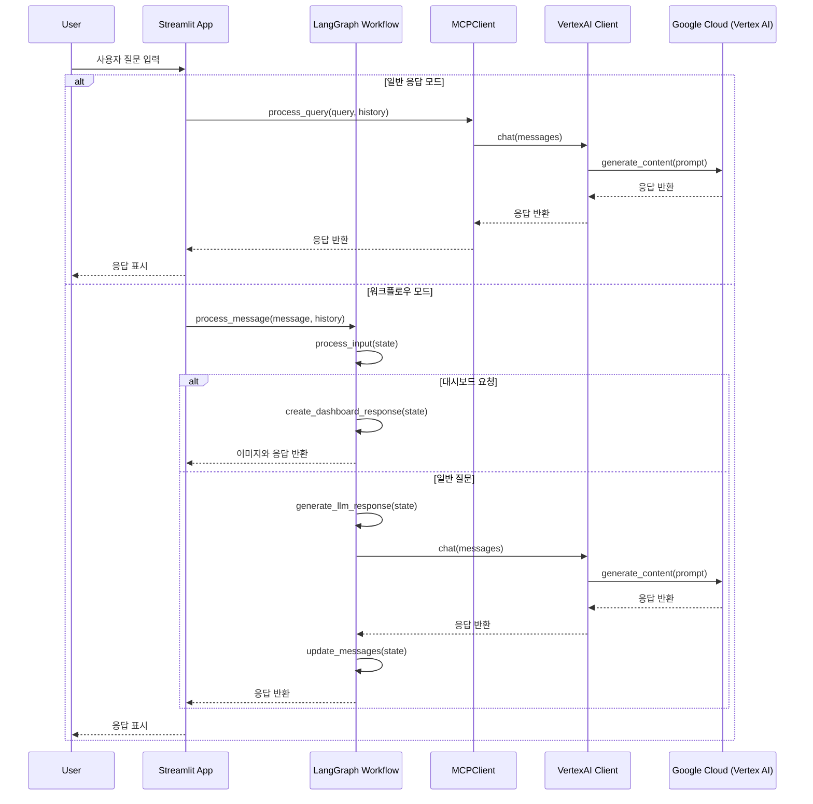

# LLM 호출 시퀀스 다이어그램

이 다이어그램은 슬라임 챗봇 프로젝트에서 LLM(Large Language Model)을 호출하는 전체 흐름을 보여줍니다.

## 시퀀스 다이어그램 설명

### 구성 요소

1. **User**: 챗봇과 상호작용하는 사용자
2. **Streamlit App**: 사용자 인터페이스를 제공하는 Streamlit 앱
3. **LangGraph Workflow**: 대화 흐름을 관리하는 상태 기반 워크플로우 시스템
4. **MCPClient**: 기존 MCP 인터페이스와 호환되는 클라이언트
5. **VertexAI Client**: Google의 Vertex AI API와 통신하는 클라이언트
6. **Google Cloud (Vertex AI)**: Gemini 모델을 제공하는 클라우드 서비스

### 호출 흐름 (일반 응답 모드)

1. 사용자가 Streamlit 앱에 질문을 입력합니다.
2. Streamlit 앱은 MCPClient의 `process_query()` 메서드를 호출합니다.
3. MCPClient는 내부적으로 VertexAI Client의 `chat()` 메서드를 호출합니다.
4. VertexAI Client는 Google Cloud Vertex AI API에 요청을 보냅니다.
5. Vertex AI는 Gemini 모델을 사용하여 응답을 생성하고 반환합니다.
6. 응답은 호출 체인을 따라 다시 사용자에게 전달됩니다.

### 호출 흐름 (워크플로우 모드)

1. 사용자가 Streamlit 앱에 질문을 입력합니다.
2. Streamlit 앱은 LangGraph Workflow의 `process_message()` 함수를 호출합니다.
3. 워크플로우는 먼저 `process_input()` 노드를 실행하여 사용자 입력을 처리합니다.
4. 입력 분석 결과에 따라 다음 단계가 결정됩니다:
   - 대시보드 요청: `create_dashboard_response()` 노드 실행
   - 일반 질문: `generate_llm_response()` 노드 실행
5. LLM 응답 생성 시 워크플로우는 VertexAI Client의 `chat()` 메서드를 호출합니다.
6. 응답이 생성되면 `update_messages()` 노드를 통해 상태가 업데이트됩니다.
7. 최종 상태가 Streamlit 앱으로 반환되어 사용자에게 표시됩니다.

## 인증 흐름

Vertex AI API 연결은 다음 두 가지 방식 중 하나로 인증됩니다:

1. **API 키 방식**: `.env` 파일에서 로드된 `VERTEX_API_KEY`를 사용
2. **서비스 계정 방식**: `GOOGLE_APPLICATION_CREDENTIALS` 환경 변수로 지정된 서비스 계정 키 파일 사용

## 오류 처리

워크플로우와 클라이언트 모두 오류 처리 메커니즘이 있어 API 호출 실패, 잘못된 응답 등의 문제가 발생하면 적절한 오류 메시지를 반환합니다. 