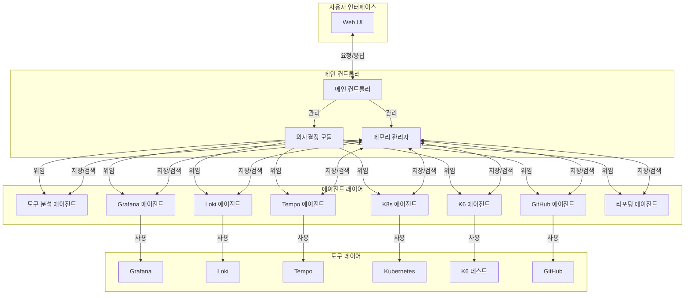
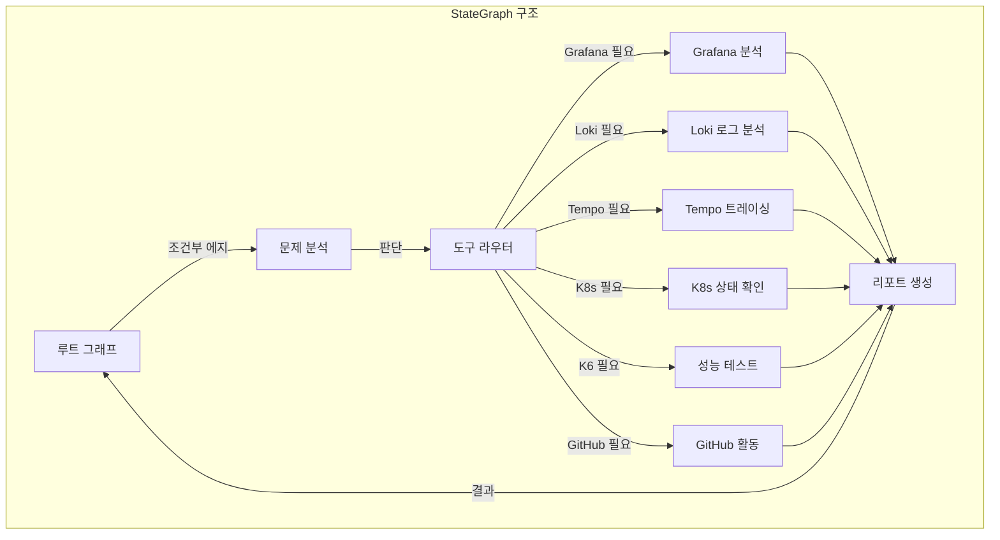
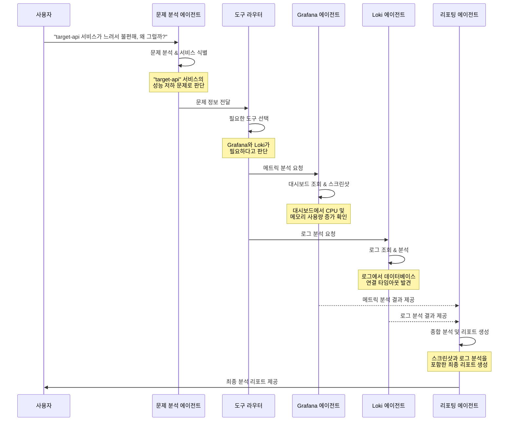

# DevOps 도구 봇 에이전트의 LangGraph 구현

이 문서는 여러 MCP 서버로 도구들을 띄워놓고, 사용자 요청에 의해 자율적으로 도구를 선택해서 시스템을 운영하는 DevOps 봇 에이전트를 LangGraph로 구현하는 방법을 설명합니다.

## 1. 전체 시스템 아키텍처



## 2. LangGraph 구현 구조



## 3. 주요 구성 요소

### 3.1 상태 정의 (State Definition)

```python
from typing import TypedDict, List, Dict, Optional, Any
from pydantic import BaseModel

class ScreenshotData(BaseModel):
    url: str
    image_path: str
    description: str

class LogData(BaseModel):
    service: str
    logs: List[str]
    summary: str

class DevOpsAgentState(TypedDict):
    # 사용자 입력 및 대화 관련
    messages: List[Dict[str, str]]
    
    # 문제 분석 관련
    problem_description: Optional[str]
    identified_services: List[str]
    
    # 도구 분석 및 선택 관련
    selected_tools: List[str]
    tool_outputs: Dict[str, Any]
    
    # Grafana 관련
    grafana_dashboards: List[str]
    screenshots: List[ScreenshotData]
    
    # Loki 관련
    logs: List[LogData]
    log_analysis: Optional[str]
    
    # 리포트 관련
    final_report: Optional[str]
```

### 3.2 주요 노드 구현

#### 3.2.1 문제 분석 노드 (Problem Analysis)

```python
def problem_analysis(state: DevOpsAgentState) -> DevOpsAgentState:
    """사용자 입력을 분석하여 문제를 파악하고 관련 서비스 식별"""
    
    # 최신 사용자 메시지 가져오기
    user_message = next((msg["content"] for msg in reversed(state["messages"]) 
                         if msg["role"] == "user"), "")
    
    # LLM을 사용하여 문제 분석
    prompt = f"""
    다음 사용자 요청을 분석하여 문제를 파악하고 관련 서비스를 식별하세요:
    
    사용자 요청: {user_message}
    
    1. 문제 설명:
    2. 관련된 서비스 이름 목록:
    """
    
    response = llm.invoke(prompt)
    
    # 응답 파싱 (실제 구현에서는 더 강건한 파싱 필요)
    problem_description = ""
    identified_services = []
    
    # 파싱 로직...
    
    return {
        **state,
        "problem_description": problem_description,
        "identified_services": identified_services
    }
```

#### 3.2.2 도구 라우터 노드 (Tool Router)

```python
def tool_router(state: DevOpsAgentState) -> str:
    """문제 분석 결과에 따라 적절한 도구 노드로 라우팅"""
    
    problem = state.get("problem_description", "")
    services = state.get("identified_services", [])
    
    # LLM을 사용하여 필요한 도구 결정
    prompt = f"""
    다음 문제와 서비스 목록을 분석하여 어떤 모니터링/디버깅 도구를 사용해야 할지 결정하세요:
    
    문제: {problem}
    관련 서비스: {', '.join(services)}
    
    가능한 도구:
    - Grafana (시스템 메트릭 시각화)
    - Loki (로그 분석)
    - Tempo (분산 트레이싱)
    - Kubernetes (컨테이너 상태)
    - K6 (성능 테스트)
    - GitHub (코드 분석)
    
    선택해야 할 도구:
    """
    
    response = llm.invoke(prompt)
    
    # 응답 기반 라우팅 결정
    if "grafana" in response.lower():
        return "grafana_analysis"
    elif "loki" in response.lower():
        return "loki_analysis"
    # 다른 도구에 대한 조건 추가...
    
    # 기본값
    return "grafana_analysis"
```

#### 3.2.3 Grafana 분석 노드 (Grafana Analysis)

```python
def grafana_analysis(state: DevOpsAgentState) -> DevOpsAgentState:
    """Grafana 대시보드를 분석하고 스크린샷 캡처"""
    
    services = state.get("identified_services", [])
    
    # Grafana 대시보드 식별
    dashboards = find_relevant_dashboards(services)
    
    # 대시보드 스크린샷 캡처
    screenshots = []
    for dashboard in dashboards:
        screenshot_path = capture_dashboard_screenshot(dashboard)
        screenshots.append(ScreenshotData(
            url=dashboard["url"],
            image_path=screenshot_path,
            description=f"Dashboard for {dashboard['name']}"
        ))
    
    # 대시보드 분석
    analysis = analyze_dashboard_metrics(dashboards)
    
    return {
        **state,
        "grafana_dashboards": [d["url"] for d in dashboards],
        "screenshots": screenshots,
        "tool_outputs": {
            **state.get("tool_outputs", {}),
            "grafana": {
                "analysis": analysis
            }
        },
        "selected_tools": [*state.get("selected_tools", []), "grafana"]
    }
```

#### 3.2.4 Loki 로그 분석 노드 (Loki Log Analysis)

```python
def loki_analysis(state: DevOpsAgentState) -> DevOpsAgentState:
    """Loki에서 관련 로그를 조회하고 분석"""
    
    services = state.get("identified_services", [])
    time_range = determine_time_range(state)
    
    # 로그 조회
    logs_by_service = {}
    for service in services:
        logs = query_loki_logs(service, time_range)
        logs_by_service[service] = logs
    
    # 로그 분석
    log_data = []
    for service, logs in logs_by_service.items():
        summary = analyze_logs(logs)
        log_data.append(LogData(
            service=service,
            logs=logs[:10],  # 처음 10개 로그만 저장
            summary=summary
        ))
    
    return {
        **state,
        "logs": log_data,
        "log_analysis": generate_log_analysis_summary(log_data),
        "tool_outputs": {
            **state.get("tool_outputs", {}),
            "loki": {
                "log_data": log_data
            }
        },
        "selected_tools": [*state.get("selected_tools", []), "loki"]
    }
```

#### 3.2.5 리포트 생성 노드 (Report Generation)

```python
def report_generation(state: DevOpsAgentState) -> DevOpsAgentState:
    """수집된 모든 정보를 바탕으로 최종 리포트 생성"""
    
    problem = state.get("problem_description", "")
    tools = state.get("selected_tools", [])
    tool_outputs = state.get("tool_outputs", {})
    
    # 리포트 템플릿 구성
    report_sections = []
    
    # 문제 설명 섹션
    report_sections.append(f"## 문제 분석\n\n{problem}")
    
    # Grafana 분석 섹션 (있는 경우)
    if "grafana" in tools and "grafana" in tool_outputs:
        grafana_data = tool_outputs["grafana"]
        screenshots = state.get("screenshots", [])
        
        report_sections.append("## 시스템 메트릭 분석 (Grafana)")
        report_sections.append(grafana_data["analysis"])
        
        # 스크린샷 포함
        for screenshot in screenshots:
            report_sections.append(f"")
    
    # Loki 로그 분석 섹션 (있는 경우)
    if "loki" in tools and "loki" in tool_outputs:
        logs_data = tool_outputs["loki"]
        log_analysis = state.get("log_analysis", "")
        
        report_sections.append("## 로그 분석 (Loki)")
        report_sections.append(log_analysis)
        
        # 주요 로그 샘플 포함
        for log_entry in state.get("logs", []):
            report_sections.append(f"### {log_entry.service} 로그 샘플")
            report_sections.append("```")
            report_sections.append("\n".join(log_entry.logs[:5]))
            report_sections.append("```")
    
    # 다른 도구 결과 섹션 추가...
    
    # 최종 권장사항 섹션
    recommendations = generate_recommendations(state)
    report_sections.append("## 권장 조치 사항")
    report_sections.append(recommendations)
    
    # 최종 리포트 완성
    final_report = "\n\n".join(report_sections)
    
    return {
        **state,
        "final_report": final_report
    }
```

## 4. LangGraph 그래프 구성

```python
from langgraph.graph import StateGraph, END
from langgraph.checkpoint import MemorySaver
from langchain_openai import ChatOpenAI

# LLM 초기화
llm = ChatOpenAI()

# 그래프 생성
devops_graph = StateGraph(DevOpsAgentState)

# 노드 추가
devops_graph.add_node("problem_analysis", problem_analysis)
devops_graph.add_node("grafana_analysis", grafana_analysis)
devops_graph.add_node("loki_analysis", loki_analysis)
devops_graph.add_node("tempo_analysis", tempo_analysis)
devops_graph.add_node("k8s_analysis", k8s_analysis)
devops_graph.add_node("k6_analysis", k6_analysis)
devops_graph.add_node("github_analysis", github_analysis)
devops_graph.add_node("report_generation", report_generation)

# 조건부 에지 추가
devops_graph.add_edge("problem_analysis", tool_router)
devops_graph.add_conditional_edges(
    "problem_analysis",
    tool_router,
    {
        "grafana_analysis": "grafana_analysis",
        "loki_analysis": "loki_analysis",
        "tempo_analysis": "tempo_analysis",
        "k8s_analysis": "k8s_analysis",
        "k6_analysis": "k6_analysis",
        "github_analysis": "github_analysis"
    }
)

# 각 분석 도구에서 리포트 생성으로 에지 추가
for tool in ["grafana_analysis", "loki_analysis", "tempo_analysis", 
             "k8s_analysis", "k6_analysis", "github_analysis"]:
    devops_graph.add_edge(tool, "report_generation")

# 리포트 생성 완료 후 종료
devops_graph.add_edge("report_generation", END)

# 메모리 관리
memory_saver = MemorySaver()

# 그래프 컴파일
app = devops_graph.compile(checkpointer=memory_saver)
```

## 5. 도구 구현 - 핵심 헬퍼 함수

```python
# Grafana 관련 함수
def find_relevant_dashboards(services: List[str]) -> List[Dict]:
    """서비스 목록에 관련된 Grafana 대시보드 찾기"""
    # Grafana API 호출 구현
    # ...
    return [{"name": service, "url": f"https://grafana.example.com/d/{service}"} for service in services]

def capture_dashboard_screenshot(dashboard: Dict) -> str:
    """Grafana 대시보드 스크린샷 캡처"""
    # 웹 브라우저 자동화 또는 Grafana API 사용
    # ...
    return f"/tmp/screenshots/{dashboard['name']}.png"

def analyze_dashboard_metrics(dashboards: List[Dict]) -> str:
    """대시보드 메트릭 분석"""
    # 메트릭 데이터 가져오기 및 분석
    # ...
    return "CPU 사용량이 평소보다 30% 증가했으며, 메모리 사용량도 높은 상태입니다."

# Loki 관련 함수
def determine_time_range(state: DevOpsAgentState) -> Dict:
    """문제 발생 시점 기반으로 시간 범위 결정"""
    # 문제 분석을 통해 시간 범위 추출
    # ...
    return {"from": "now-1h", "to": "now"}

def query_loki_logs(service: str, time_range: Dict) -> List[str]:
    """Loki에서 로그 조회"""
    # Loki API 호출 구현
    # ...
    return [f"[ERROR] Service {service} failed with error XYZ", 
            f"[INFO] Service {service} started", 
            f"[WARN] High latency detected in {service}"]

def analyze_logs(logs: List[str]) -> str:
    """로그 패턴 분석"""
    # 로그 분석 로직
    # ...
    return "에러 패턴 분석 결과, 서비스 XYZ에서 데이터베이스 연결 타임아웃이 발생하고 있습니다."

def generate_log_analysis_summary(log_data: List[LogData]) -> str:
    """전체 로그 분석 요약"""
    summaries = [data.summary for data in log_data]
    return "\n\n".join(summaries)

# 리포트 관련 함수
def generate_recommendations(state: DevOpsAgentState) -> str:
    """분석 결과를 바탕으로 권장 조치 사항 생성"""
    # LLM을 사용하여 권장사항 생성
    # ...
    return "1. 데이터베이스 연결 풀 확장\n2. 서비스 XYZ 인스턴스 수 증가\n3. 메모리 할당량 검토"
```

## 6. 멀티에이전트 통합 시나리오 - 순차 다이어그램

아래 다이어그램은 사용자가 "target-api 서비스가 느려서 불편해, 왜 그럴까?"라는 질문을 했을 때의 에이전트 상호작용을 보여줍니다.



## 7. 인간-루프-포함 상호작용

특정 상황에서는 인간의 판단이 필요할 수 있습니다. 이를 위해 LangGraph의 interrupt 기능을 활용하여 인간-루프-포함(Human-in-the-loop) 상호작용을 구현할 수 있습니다.

```python
from langgraph.graph import interrupt_before

# 도구 선택 단계에서 인간 확인이 필요한 경우
devops_graph.add_node("problem_analysis", problem_analysis, 
                      interrupt_before=["tool_selection"])

# 인터럽트 처리 함수
def on_tool_selection_interrupt(state, interrupt_data):
    problem = state.get("problem_description", "")
    services = state.get("identified_services", [])
    
    # 사용자에게 표시할 정보
    user_message = f"""
    문제: {problem}
    식별된 서비스: {', '.join(services)}
    
    에이전트는 다음 도구를 사용하려고 합니다:
    - Grafana
    - Loki
    
    이 선택을 승인하거나 수정하시겠습니까?
    """
    
    # 사용자 응답을 기다리는 로직 (실제 구현에서는 웹 인터페이스 등과 연동)
    user_approval = get_user_approval(user_message)
    
    if user_approval["approved"]:
        return {**state, "selected_tools": user_approval["tools"]}
    else:
        # 사용자가 거부한 경우 기본값 사용
        return {**state, "selected_tools": ["grafana", "loki"]}
```

## 8. 결론

이 문서에서는 DevOps 도구 봇 에이전트를 OpenHands 아키텍처와 유사하게 LangGraph를 활용하여 구현하는 방법을 설명했습니다. 주요 특징은 다음과 같습니다:

1. **모듈화된 에이전트 구조**: 각 도구(Grafana, Loki 등)마다 전문화된 에이전트를 구현
2. **상태 기반 워크플로우**: DevOpsAgentState를 통해 에이전트 간 정보 공유
3. **조건부 라우팅**: 문제 성격에 따라 적절한 도구 선택
4. **멀티에이전트 협업**: 여러 전문 에이전트가 협력하여 문제 해결
5. **인간-루프-포함**: 필요시 사용자의 개입 지원
6. **지속성 관리**: MemorySaver를 통한 대화 상태 유지

이 구현을 통해 사용자는 "target-api 서비스가 느려서 불편해, 왜 그럴까?"와 같은 자연어 질문을 할 수 있으며, 에이전트는 자동으로 적절한 도구를 선택하고 분석하여 종합적인 리포트를 제공할 수 있습니다. 