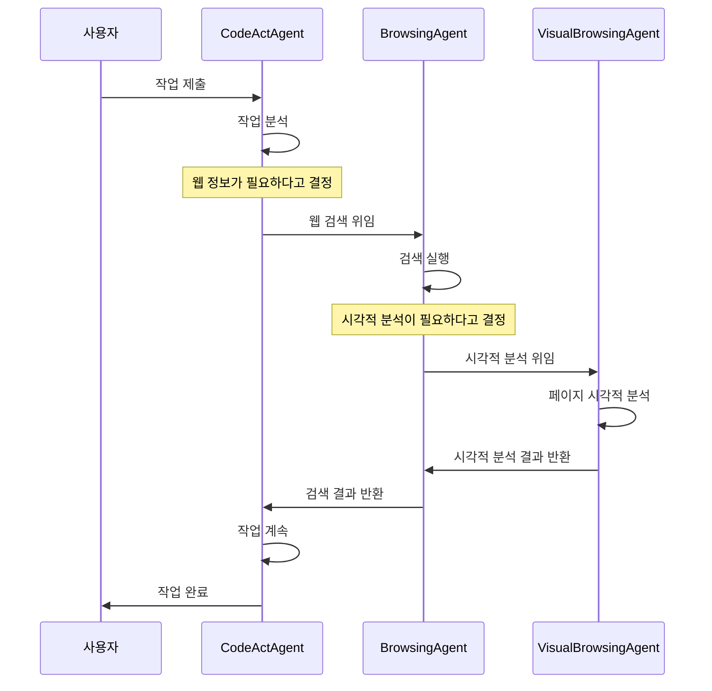
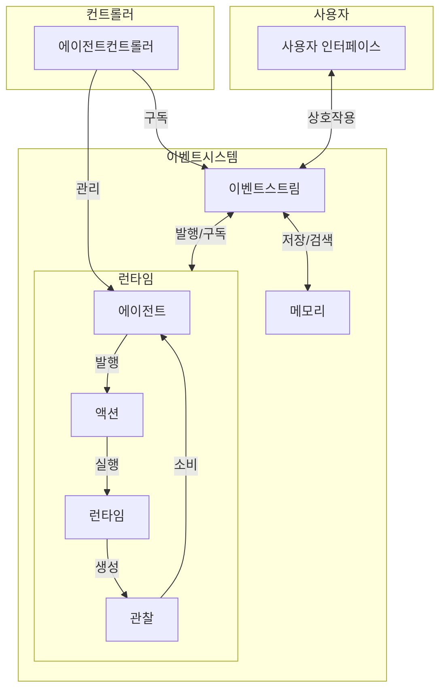

# OpenHands 에이전트 아키텍처

OpenHands(과거 OpenDevin)는 AI 기반 소프트웨어 개발 에이전트를 위한 플랫폼입니다. 이 플랫폼은 자율 에이전트가 코드 작성, 명령 실행, 웹 검색, API 호출 등 인간 개발자가 할 수 있는 모든 작업을 수행할 수 있게 합니다.

이 문서는 에이전트 아키텍처의 개요를 제공하며, 다양한 컴포넌트가 어떻게 상호작용하여 전문화된 에이전트 간의 협업을 통해 복잡한 개발 작업을 처리할 수 있는 유연한 멀티 에이전트 시스템을 구성하는지 보여줍니다.

## 시스템 아키텍처 다이어그램

```mermaid
graph TD
    subgraph "컨트롤러 레이어"
        AC[AgentController] --> |관리| AG[Agent]
        AC --> |제어| S[State]
        AC --> |사용| RM[ReplayManager]
        AC --> |감지| SD[StuckDetector]
        AC --> |생성| DAC[Delegate AgentController]
    end

    subgraph "에이전트 레이어"
        AG --> |구현| BA[BaseMicroagent]
        AG --> |사용| LLM[LLM]
        
        BA --> KMA[KnowledgeMicroagent]
        BA --> RMA[RepoMicroagent]
        
        AG --> |특수 구현| AH[AgentHub]
        
        AH --> CAA[CodeActAgent]
        AH --> BRA[BrowsingAgent]
        AH --> VBA[VisualBrowsingAgent]
        AH --> ROA[ReadOnlyAgent]
        AH --> DA[DummyAgent]
    end

    subgraph "이벤트 시스템"
        ES[EventStream] --> ACT[Actions]
        ES --> OBS[Observations]
        
        ACT --> CRA[CmdRunAction]
        ACT --> FRA[FileReadAction]
        ACT --> FWA[FileWriteAction]
        ACT --> BUA[BrowseURLAction]
        ACT --> MA[MessageAction]
        ACT --> AFA[AgentFinishAction]
        ACT --> ARA[AgentRejectAction]
        ACT --> ADA[AgentDelegateAction]
        
        OBS --> CRO[CmdOutputObservation]
        OBS --> FRO[FileReadObservation]
        OBS --> FWO[FileWriteObservation]
        OBS --> BO[BrowserOutputObservation]
        OBS --> EO[ErrorObservation]
        OBS --> SO[SuccessObservation]
    end
    
    subgraph "런타임 시스템"
        RT[Runtime] --> |실행| ACT
        RT --> |생성| OBS
    end

    subgraph "메모리 시스템"
        MEM[Memory] --> |저장| ES
    end

    S --> |추적| ES
    AC --> |생산/소비| ES
    AG --> |생산| ACT
    AG --> |소비| OBS
    
    subgraph "멀티 에이전트 기능"
        AG --> |위임| OA[다른 에이전트]
        AG --> |처리| TASK[작업]
        AG --> |관리| SUBTASK[하위작업]
    end
```

## 주요 구성 요소

### 컨트롤러 레이어
- **AgentController**: 에이전트 실행 루프를 관리하는 중앙 컴포넌트
- **State**: 시스템 내 에이전트의 실행 상태를 나타냄
- **StuckDetector**: 에이전트가 루프에 갇혔을 때 감지
- **ReplayManager**: 디버깅 또는 세션 재개를 위한 이벤트 재생 처리

### 에이전트 레이어
- **Agent**: 모든 에이전트가 구현하는 추상 기본 클래스
- **BaseMicroagent**: 전문 지식을 제공하는 마이크로에이전트의 기본 클래스
  - **KnowledgeMicroagent**: 키워드에 의해 트리거되어 전문 지식 제공
  - **RepoMicroagent**: 저장소별 특정 지침 포함

### AgentHub (전문 에이전트)
- **CodeActAgent**: 소프트웨어 개발 작업을 위한 주 에이전트
- **BrowsingAgent**: 웹 브라우징 작업 전문
- **VisualBrowsingAgent**: 시각적 브라우징 작업 처리
- **ReadOnlyAgent**: 파일을 수정하지 않고 읽기만 가능한 제한된 에이전트
- **DummyAgent**: 테스트 목적의 간단한 에이전트

### 이벤트 시스템
- **EventStream**: 컴포넌트 간 통신을 위한 중앙 이벤트 버스
- **Actions**: 에이전트가 발행하는 명령(CmdRunAction, FileReadAction 등)
- **Observations**: 액션의 결과(CmdOutputObservation, FileReadObservation 등)

### 멀티 에이전트 기능
- **위임(Delegation)**: 에이전트가 다른 전문 에이전트에게 작업을 위임 가능
- **작업 및 하위작업**: 작업은 다른 에이전트에게 할당할 수 있는 작업과 하위작업으로 구성

## 에이전트 실행 흐름

1. AgentController가 State로 Agent를 초기화
2. 각 반복마다 컨트롤러는 `agent.step(state)`를 호출
3. Agent는 LLM을 사용하여 Action을 결정
4. Runtime이 Action을 실행
5. 결과 Observation은 EventStream에 추가
6. Agent는 다음 단계에서 Observation을 처리
7. 완료되면 Agent는 AgentFinishAction을 발행

## 에이전트 위임 프로세스

1. 에이전트가, 전문 에이전트의 도움이 필요하다고 판단
2. AgentDelegateAction을 발행
3. AgentController가 새로운 위임 컨트롤러 생성
4. 위임받은 에이전트가 작업 수행
5. 완료 시 원래 에이전트로 제어권 반환
6. 원래 에이전트는 위임된 에이전트의 결과와 함께 작업 계속

이 아키텍처는 에이전트가 전문화된 기능을 활용하여 복잡한 작업에 협력할 수 있는 유연하고 확장 가능한 시스템을 제공합니다.

## 멀티 에이전트 위임 흐름

## 사용 예제

OpenHands 에이전트 시스템은 여러 방식으로 사용할 수 있습니다:

1. **단일 에이전트 모드**: CodeActAgent와 같은 단일 에이전트가 전체 작업을 수행
2. **멀티 에이전트 협업**: 여러 에이전트가 함께 작업하며, 전문화된 작업은 위임
3. **마이크로에이전트 지식 향상**: 마이크로에이전트가 키워드에 트리거되어 맥락별 지식 제공

## 개발 및 확장

새 에이전트 생성 방법:
1. Agent 추상 클래스 구현
2. AgentHub에 추가
3. 필요한 모든 상태 및 이벤트 상호작용을 적절히 처리하는지 확인

새 마이크로에이전트 생성 방법:
1. 프론트매터 메타데이터가 있는 마크다운 파일 생성
2. 지식 에이전트를 위한 트리거 또는 저장소별 정보 정의
3. 자동 로딩을 위해 적절한 디렉토리에 배치

## 이벤트 기반 통신

이 다이어그램은 시스템을 통한 이벤트 흐름을 보여줍니다:
1. 에이전트는 EventStream에 발행되는 Action을 발행
2. 런타임이 Action을 실행하고 Observation 생성
3. Observation은 EventStream에 다시 발행
4. 에이전트는 다음 Action을 결정하기 위해 Observation을 소비
5. EventStream은 중앙 통신 허브 제공
6. 메모리 시스템은 나중에 참조할 수 있도록 이벤트 기록 저장 