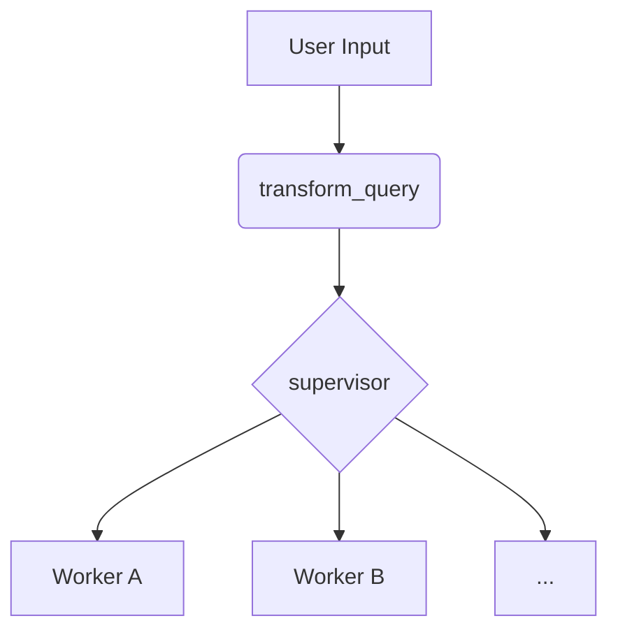

Q1). 랭그래프 에이전트를 써 보면, 사용자가 쿼리를 정확하게 입력해야 원하는 결과가 나옵니다. 이걸 더 유연하게 사용자가 원하는 것을 알아서 가져다 주도록 개선할 수 있는 방법이 있을까요?

**A1).**

네, LangGraph 에이전트가 사용자의 의도를 더 유연하게 파악하도록 개선할 수 있는 몇 가지 방법이 있습니다.

1.  **더 강력한 LLM 사용**: GPT-4, Claude 3 Opus와 같이 더 발전된 언어 모델을 사용하면, 부정확하거나 모호한 사용자 쿼리에 대해서도 문맥을 파악하고 의도를 더 잘 이해할 수 있습니다.
2.  **쿼리 변환 (Query Transformation)**: 사용자의 입력을 받아서 더 명확하고 구조화된 쿼리로 변환하는 단계를 추가할 수 있습니다. 이 단계는 또 다른 LLM을 사용하여 구현할 수 있으며, "입력 쿼리를 에이전트가 이해하기 좋은 형태로 바꿔줘" 와 같은 프롬프트를 사용할 수 있습니다.
3.  **Few-shot 프롬프팅**: 에이전트의 프롬프트에 다양한 사용자 쿼리 예시와 그에 해당하는 이상적인 처리 결과를 몇 가지 포함시키는 방법입니다. 이를 통해 모델은 비슷한 유형의 쿼리가 들어왔을 때 어떻게 처리해야 할지 학습할 수 있습니다.
4.  **질의 명확화 (Clarification) 단계 추가**: 사용자의 쿼리가 모호할 경우, 에이전트가 추측해서 답을 내놓는 대신 "혹시 이런 의미로 질문하신 건가요?" 와 같이 되물어보는 단계를 그래프에 추가할 수 있습니다. 이를 통해 사용자의 의도를 명확히 하고 더 정확한 결과를 제공할 수 있습니다.

---

Q1-1). 그럼, 특정 노드 (예: 플래닝) 에서만 한정적으로 좋은 모델을 쓰는 방법도 있을까요?

**A1-1).**

네, 물론입니다. LangGraph의 각 노드는 독립적인 Python 함수이기 때문에, 노드별로 다른 모델을 자유롭게 사용할 수 있습니다.

예를 들어, 복잡한 추론과 계획이 필요한 '플래닝' 노드에서는 GPT-4와 같은 고성능 모델을 사용하고, 단순히 텍스트를 분류하거나 요약하는 다른 노드에서는 GPT-3.5 Turbo나 Llama 3 8B와 같은 더 빠르고 비용 효율적인 모델을 사용하는 것이 일반적인 최적화 방법입니다.

```python
# planning_node.py
from langchain_openai import ChatOpenAI

def run_planning(state):
    # 이 노드에서는 고성능 모델 사용
    llm = ChatOpenAI(model="gpt-4-turbo") 
    # ... llm을 사용한 계획 수립 로직 ...
    return {"plan": "..."}

# summarizer_node.py
from langchain_openai import ChatOpenAI

def summarize(state):
    # 이 노드에서는 비용 효율적인 모델 사용
    llm = ChatOpenAI(model="gpt-3.5-turbo")
    # ... llm을 사용한 요약 로직 ...
    return {"summary": "..."}
```

Q1-2). 쿼리 변환 기능은 langgraph 에서 지원하나요? 짧은 예제 코드를 작성해 주세요.

**A1-2).**

네, LangGraph에서 쿼리 변환은 별도의 기능이 아니라 그래프의 '노드'로 직접 구현할 수 있습니다. 사용자의 입력을 `state`에서 받아, LLM을 이용해 더 명확한 형태로 변환한 뒤, 다시 `state`를 업데이트하여 다음 노드로 전달하는 방식입니다.

```python
from typing import TypedDict, Annotated
import operator
from langchain_openai import ChatOpenAI
from langgraph.graph import StateGraph, END

# 1. State 정의
class AgentState(TypedDict):
    original_query: str
    transformed_query: Annotated[str, operator.set] # 마지막 값으로 덮어쓰기
    
# 2. 쿼리 변환 노드
def transform_query_node(state: AgentState):
    """사용자 쿼리를 명확하게 변환하는 노드"""
    llm = ChatOpenAI(model="gpt-3.5-turbo")
    prompt = f"다음 사용자 쿼리를 검색에 용이하도록 명확하고 상세하게 변환해줘: '{state['original_query']}'"
    response = llm.invoke(prompt)
    return {"transformed_query": response.content}

# 3. 그래프 정의 및 실행
workflow = StateGraph(AgentState)
workflow.add_node("transform_query", transform_query_node)
# ... 이후 변환된 쿼리를 사용하는 다른 노드 추가
workflow.set_entry_point("transform_query")
workflow.add_edge("transform_query", END) # 예제 단순화를 위해 바로 종료

app = workflow.compile()
result = app.invoke({"original_query": "서울 날씨"})
print(result['transformed_query'])
# 출력 예: '오늘 서울의 현재 날씨와 주간 예보 정보를 알려주세요.'
```

Q2). LangGraph 에서 이전의 대화 내역을 참고해서 답할 수 있도록 하는 기능이 있나요?

**A2).**

네, LangGraph는 이전 대화 내역을 기억하고 참고해서 답변하는 기능을 지원합니다. 이는 LangGraph의 핵심적인 기능 중 하나입니다.

1.  **State 관리**: LangGraph의 모든 작업은 `State`라는 객체를 통해 이뤄집니다. 이 `State` 객체에 대화 기록을 리스트 형태로 저장할 수 있습니다. 그래프의 각 노드(작업 단위)는 현재 `State`에 접근할 수 있으므로, 이전 대화 내역을 읽고 새로운 대화를 추가하는 것이 가능합니다.
2.  **메모리(Memory) 활용**: LangChain에서 제공하는 `ConversationBufferMemory`와 같은 메모리 모듈을 LangGraph와 함께 사용할 수 있습니다.
3.  **체크포인터 (Checkpointer)**: 대화가 길어지더라도 상태를 잃어버리지 않도록, LangGraph는 `Checkpointer` 기능을 제공합니다. 이를 사용하면 현재까지의 대화 상태(State)를 특정 저장소(예: In-memory, SQLite, Postgres)에 저장하고, 필요할 때 다시 불러와서 대화를 이어갈 수 있습니다.

Q2-1). in-memory 에 저장하도록 하려면 어떻게 하나요? 짧은 예제 코드를 작성해 주세요.

**A2-1).**

`MemorySaver`를 사용하여 인메모리(in-memory) 체크포인터를 설정할 수 있습니다. 그래프를 컴파일할 때 `checkpointer` 인자로 `MemorySaver` 객체를 넘겨주기만 하면 됩니다.

이렇게 설정하면, `invoke`나 `stream`을 호출할 때 `configurable` 딕셔너리에 `thread_id`를 지정하여 각 대화의 상태를 메모리 상에서 관리할 수 있습니다.

```python
from langgraph.checkpoint.memory import MemorySaver

# ... AgentState, 노드, 그래프(workflow) 정의는 위 예제와 동일 ...

# 인메모리 체크포인터 생성
memory = MemorySaver()

# 체크포인터를 포함하여 그래프 컴파일
app = workflow.compile(checkpointer=memory)

# 대화 ID를 지정하여 실행
thread_id_1 = "user_123"
config = {"configurable": {"thread_id": thread_id_1}}
app.invoke({"original_query": "안녕?"}, config=config)

thread_id_2 = "user_456"
config_2 = {"configurable": {"thread_id": thread_id_2}}
app.invoke({"original_query": "반가워."}, config=config_2)


# thread_id_1의 대화 상태 스냅샷 가져오기
snapshot = memory.get(config)
print(snapshot)
```

Q2-2). 그럼 supervisor pattern 으로 구현한 에이전트에 query transformation 노드를 어느 위치에 추가하면 좋을까요?

**A2-2).**

Supervisor 패턴에서 **쿼리 변환(Query Transformation) 노드는 Supervisor 노드 바로 앞에 위치**시키는 것이 가장 좋습니다. 즉, 그래프의 진입점(Entry Point) 바로 다음입니다.

**흐름:**

`사용자 입력` → `쿼리 변환 노드` → `Supervisor(라우터) 노드` → `각 Worker 노드`



**이렇게 구성하는 이유:**

1.  **라우팅 정확도 향상**: Supervisor는 모호할 수 있는 원래 쿼리 대신, 명확하게 정제된 쿼리를 기반으로 어떤 Worker에게 작업을 맡길지 판단합니다. 이는 라우팅의 정확도를 크게 높여줍니다.
2.  **역할의 분리**: Supervisor의 역할은 '라우팅'에만 집중하도록 유지할 수 있습니다. 쿼리 변환의 책임을 Supervisor에게 함께 맡기면 프롬프트가 복잡해지고, 라우팅 성능이 저하될 수 있습니다.
3.  **효율성**: 초반에 쿼리를 한 번만 정제하면, 이후의 모든 노드(Supervisor, Worker)가 그 혜택을 볼 수 있습니다. 각 Worker가 개별적으로 쿼리를 해석할 필요가 없어집니다.

---

Q3). LangGraph 에서 사용자의 요청을 알맞는 worker agent 로 라우팅하기 위한 방법에 대해 소개해줘.

**A3).**

LangGraph에서 사용자의 요청을 가장 적합한 워커 에이전트(Worker Agent)로 라우팅하는 것은 **조건부 엣지(Conditional Edge)**를 통해 구현할 수 있습니다.

1.  **라우터 노드(Router Node) 생성**: 먼저, 사용자의 요청을 분석하여 어떤 워커에게 전달할지 결정하는 '라우터' 역할을 하는 노드를 생성합니다. 이 라우터는 보통 LLM으로 구현됩니다.
2.  **프롬프트를 통한 라우팅**: 라우터 노드의 프롬프트에 각 워커 에이전트가 어떤 역할을 하는지에 대한 설명을 제공합니다. 그리고 사용자 요청이 들어왔을 때, "이 요청을 처리하기에 가장 적합한 워커는 A, B, C 중 무엇인가?"라고 LLM에게 물어보도록 합니다.
3.  **조건부 엣지 (Conditional Edges) 설정**: `add_conditional_edges` 함수를 사용하여 라우터 노드의 결과에 따라 다음으로 실행될 노드를 동적으로 결정하도록 설정합니다. 예를 들어, 라우터가 'A'를 반환하면 A 워커 노드로, 'B'를 반환하면 B 워커 노드로 요청을 보내도록 분기점을 만드는 것입니다.
4.  **도구(Tool) 기반 라우팅**: 워커 에이전트들을 하나의 '도구(Tool)'로 정의하고, LLM의 도구 사용(Tool Calling/Function Calling) 기능을 활용하여 가장 적절한 도구를 선택하게 만드는 방법도 효과적입니다.


Q3-1). 그럼, routing 을 구현하기 위한 프롬프트 예시를 들어줘.

**A3-1).**

네, 라우팅을 구현하기 위한 프롬프트 예시입니다. 프롬프트의 핵심은 **LLM에게 각 워커(worker)의 역할을 명확히 설명**하고, **어떤 기준으로 선택해야 하는지 안내**하는 것입니다.

**방법 1: 간단한 텍스트 기반 라우팅 프롬프트**

이 방식은 LLM이 여러 워커의 이름 중 하나를 텍스트로 반환하도록 요청하는 가장 간단한 방법입니다.

```python
routing_prompt_template = """당신은 사용자 요청을 분석하여 가장 적절한 전문가에게 전달하는 라우터입니다.
사용자의 질문을 보고, 아래 설명된 전문가 중 한 명의 이름을 정확하게 반환해야 합니다. 다른 말은 절대 추가하지 마세요.

사용 가능한 전문가:

1. `weather_expert`:
   - 역할: 특정 지역의 현재 날씨, 주간 예보, 기온, 습도 등 날씨 관련 정보를 제공합니다.
   - 예시: "서울 날씨 어때?", "내일 부산 비 와?"

2. `stock_expert`:
   - 역할: 특정 회사의 현재 주가, 시가 총액, 관련 뉴스 등 주식 정보를 제공합니다.
   - 예시: "삼성전자 주가 알려줄래?", "테슬라 시총이 얼마야?"

3. `general_assistant`:
   - 역할: 날씨나 주식 관련이 아닌, 일반적인 대화나 질문에 응답합니다.
   - 예시: "안녕?", "수고했어"

사용자 질문: "{user_query}"

가장 적합한 전문가 이름:"""

# 사용 예시
# user_query = "오늘 삼성전자 주식 가격 알려줄래?"
# prompt = routing_prompt_template.format(user_query=user_query)
# llm.invoke(prompt) -> "stock_expert"
```

**방법 2: 도구 호출(Tool Calling)을 이용한 라우팅 (더욱 안정적)**

이 방식은 각 라우팅 대상을 LLM이 호출할 수 있는 '도구'로 정의합니다. LLM이 JSON과 같은 구조화된 형식으로 답변을 반환하므로, 후속 처리가 더 안정적이고 실수가 적습니다.

```python
from langchain_core.pydantic_v1 import BaseModel, Field
from langchain_openai import ChatOpenAI

# LLM 정의
llm = ChatOpenAI(model="gpt-4-turbo")

# 각 라우팅 경로를 Pydantic 모델로 정의 (도구 스키마가 됨)
class WeatherRoute(BaseModel):
    """날씨 관련 질문일 때 선택됩니다."""
    pass

class StockRoute(BaseModel):
    """주식 관련 질문일 때 선택됩니다."""
    pass

# LLM에 도구를 바인딩하고 라우터 체인 생성
# .bind_tools()는 어떤 도구를 사용할 수 있는지 알려주는 역할을 합니다.
# 마지막의 `lambda msg: msg.tool_calls[0]['name']` 부분은, 
# LLM이 선택한 도구 호출 정보에서 도구의 이름만 추출하는 역할을 합니다.
llm_with_tools = llm.bind_tools([WeatherRoute, StockRoute])
router = llm_with_tools | (lambda msg: msg.tool_calls[0]['name'] if msg.tool_calls else "general_assistant")

# 사용 예시
# print(router.invoke("오늘 삼성전자 주식 가격 알려줄래?"))
# -> "StockRoute"

# print(router.invoke("제주도 날씨는?"))
# -> "WeatherRoute"

# print(router.invoke("안녕"))
# -> "general_assistant"
```

**어떤 방법을 선택해야 할까요?**

-   **방법 1**은 구현이 매우 간단하고 직관적입니다.
-   **방법 2**는 모델이 정해진 스키마(도구)에 따라 출력하므로, "제가 뭘 도와드릴까요?" 와 같은 의도치 않은 텍스트가 섞여 나올 확률이 거의 없어 훨씬 안정적입니다. 대부분의 현대적인 에이전트 설계에서는 **도구 호출 기반의 라우팅**을 선호합니다.

---

Q4). LangGraph 로 에이전트를 개발할 때, 개발자가 신경써서 최적화해야 하는 부분이 뭔지 알려줘.

**A4).**

LangGraph로 에이전트를 개발할 때 최적화를 위해 신경써야 할 부분은 다음과 같습니다.

1.  **State 설계**: `State` 객체는 에이전트의 상태를 담는 핵심 요소입니다. 너무 많은 정보를 담으면 비용과 지연 시간이 증가하므로, 각 노드의 작업에 꼭 필요한 최소한의 정보만 포함하도록 간결하게 설계하는 것이 중요합니다.
2.  **그래프의 모듈화**: 복잡한 작업을 여러 개의 작고 독립적인 노드로 나누어 그래프를 설계하면, 개발, 디버깅, 유지보수가 훨씬 쉬워집니다. 각 노드는 하나의 명확한 책임만 갖도록 하는 것이 좋습니다.
3.  **프롬프트 엔지니어링**: 각 노드, 특히 라우팅을 담당하는 노드의 프롬프트는 에이전트의 전체 성능에 큰 영향을 미칩니다. 프롬프트는 명확하고 간결해야 하며, 필요하다면 예시(Few-shot)를 포함하여 LLM이 의도를 더 잘 파악하게 해야 합니다.
4.  **비용 및 지연 시간**: LLM 호출은 비용과 직결되므로, 불필요한 호출을 최소화해야 합니다. 라우팅이나 간단한 분류 작업에는 GPT-4와 같은 고성능 모델 대신 더 작고 빠른 모델(예: GPT-3.5 Turbo, Llama 3 8B)을 사용하는 것을 고려해볼 수 있습니다.
5.  **스트리밍(Streaming) 지원**: 사용자 경험을 높이기 위해, 최종 결과가 나올 때까지 기다리게 하는 대신, 각 노드의 결과가 생성되는 대로 사용자에게 실시간으로 보여주는 스트리밍 방식을 적용하는 것이 좋습니다. LangGraph는 스트리밍을 지원합니다.
6.  **디버깅 및 추적**: 에이전트가 복잡해질수록 내부 동작을 파악하기 어려워집니다. LangSmith와 같은 도구를 사용하면 그래프의 각 단계별 입출력과 흐름을 시각적으로 추적할 수 있어 디버깅과 성능 분석에 매우 유용합니다.

Q4-1). State 를 잘 설계해서, state 의 특정 필드를 어떻게 참고하세요 하는 식의 프롬프팅도 가능할까요? 짧은 예제 코드를 추가해 주세요.

**A4-1).**

네, 가능합니다. 이는 LangGraph의 핵심적인 디자인 패턴입니다. `State`에 필요한 데이터 필드를 명확하게 정의하고, 각 노드에서는 이 `State`의 특정 필드를 조합하여 LLM에게 전달할 프롬프트를 동적으로 생성할 수 있습니다.

아래 예제에서는 `planner_node`가 `State`의 `user_query`와 `context` 필드를 읽어와 계획(plan)을 생성하는 프롬프트를 만드는 것을 보여줍니다.

```python
from langchain_core.prompts import ChatPromptTemplate
from langchain_openai import ChatOpenAI
from typing import TypedDict

# 1. 역할에 맞게 State 필드 설계
class AgentState(TypedDict):
    user_query: str
    context: str
    plan: str

# 2. State의 특정 필드를 참고하여 프롬프팅하는 노드
def planner_node(state: AgentState):
    """'user_query'와 'context'를 참고해 'plan'을 생성"""
    
    prompt = ChatPromptTemplate.from_template(
        "사용자 질문: {query}\n\n"
        "관련 컨텍스트: {context}\n\n"
        "위 정보들을 바탕으로 질문에 답하기 위한 단계별 계획을 세워주세요."
    )
    
    # 고성능 모델로 계획 수립
    llm = ChatOpenAI(model="gpt-4-turbo")
    
    chain = prompt | llm
    
    # State에서 필요한 필드를 꺼내 프롬프트에 주입
    result = chain.invoke({
        "query": state["user_query"],
        "context": state["context"]
    })
    
    # State의 'plan' 필드 업데이트
    return {"plan": result.content}

# 초기 State 값
initial_state = {
    "user_query": "LangGraph의 장점은 뭐야?",
    "context": "LangGraph는 복잡한 LLM 애플리케이션을 그래프 형태로 쉽게 만들 수 있게 해주는 라이브러리입니다.",
    "plan": ""
}

# 노드 실행 및 결과 확인
plan_result = planner_node(initial_state)
print(plan_result['plan'])
```

Q5). supervisor 노드는 ReAct 프레임워크를 따르는게 좋나요? 아니면 다른 방법이 있을까요?

**A5).**
Supervisor 노드를 구현하는 데 ReAct 프레임워크를 사용하는 것은 좋은 접근 방식이 될 수 있으며, 특히 라우팅 결정에 복잡한 추론 과정이 필요할 때 유용합니다.

하지만 supervisor의 주된 역할이 단순히 요청을 적절한 워커에게 전달하는 것이라면, 더 간단하고 효율적인 대안들이 있습니다.

1.  **도구 사용(Tool Calling) 기반 라우터**: 가장 현대적이고 추천되는 방식입니다. 각 워커 에이전트를 supervisor LLM의 '도구(tool)'로 제공합니다. LLM은 사용자의 요청을 분석하고 가장 적합한 도구를 '호출'하도록 학습되어 있어, 매우 안정적이고 정확하게 라우팅할 수 있습니다.
2.  **간단한 LLM 라우터**: 각 워커의 역할과 책임을 프롬프트에 명시하고, 사용자 요청에 가장 적합한 워커의 이름을 반환하도록 LLM에게 요청하는 간단한 방식입니다. 도구 사용(Tool Calling)에 비해 구조적이지는 않지만 구현이 매우 쉽습니다.

결론적으로, 라우팅 로직이 복잡하고 투명한 추론 과정이 중요하다면 ReAct가 좋지만, 대부분의 경우에는 도구 사용(Tool Calling) 기반의 라우터가 더 효율적이고 안정적인 선택입니다.

---

Q5-1). supervisor 노드를 ReAct 로 구성하면, query transformation 노드를 supervisor 에게 툴로 주면 좋지 않을까요?

**A5-1).**
네, supervisor를 ReAct 에이전트로 구성할 경우, 쿼리 변환(query transformation)을 하나의 '도구'로 제공하는 것은 흥미로운 설계 패턴입니다.

**장점:**
*   **유연성**: Supervisor가 사용자 쿼리를 보고, 쿼리가 불분명하다고 판단될 때만 선택적으로 `query_transformation` 도구를 사용하여 쿼리를 명확하게 만든 후 라우팅을 수행할 수 있습니다.

**고려할 점 (더 추천되는 방식):**
*   **역할의 복잡성 증가**: 이 방식은 supervisor에게 '쿼리 정제'와 '라우팅'이라는 두 가지 책임을 부여합니다. 이는 supervisor의 역할을 복잡하게 만들 수 있습니다.
*   **더 나은 대안 (관심사 분리)**: `langgraph.md` 문서의 `A2-2` 답변에서 추천된 것처럼, **쿼리 변환 노드를 supervisor 노드 앞에 두는 것**이 일반적으로 더 깔끔하고 효율적인 아키텍처입니다.

    **추천 흐름:**
    `사용자 입력` → `쿼리 변환 노드` → `Supervisor(라우터) 노드` → `각 Worker 노드`

이 구조는 각 노드가 하나의 명확한 책임(Single Responsibility)을 갖게 하여 그래프 전체의 예측 가능성과 유지보수성을 높여줍니다. Supervisor는 이미 정제된 쿼리를 받는 것을 전제로 '라우팅'에만 집중할 수 있게 됩니다.

따라서 쿼리 변환을 supervisor의 도구로 제공하는 것은 가능하지만, 아키텍처의 명확성과 역할 분리를 위해 별도의 노드로 분리하여 supervisor 앞에 배치하는 것이 더 나은 설계로 여겨집니다.

Q5-2). 그럼, Grafana MCP 에 연동한 ReAct 에이전트는, 어떤 식으로 답변을 생성하나요? MCP 도구의 설명을 읽고 호출하나요? 

**A5-2).**
네, 정확합니다. ReAct 에이전트는 **도구의 설명을 읽고, 그것을 바탕으로 어떤 도구를 호출할지 결정**합니다. 이는 ReAct 뿐만 아니라 LangChain의 모든 도구 기반 에이전트의 핵심 작동 방식입니다.

`Grafana MCP 에이전트`를 예로 들면, 전체 프로세스는 다음과 같습니다.

1.  **도구 제공**: 에이전트를 생성할 때, `search_dashboards`, `get_dashboard_details`, `render_panel` 등 여러 Grafana 관련 함수들을 '도구(Tool)'로 제공합니다. 이때 각 도구(함수)에는 `@tool` 데코레이터나 `Tool` 객체를 사용하여 **이름(name)과 설명(description)**을 반드시 명시해야 합니다.
    -   **설명이 중요한 이유**: LLM은 이 설명을 보고 "아, `render_panel` 이라는 도구는 대시보드 패널을 이미지로 만들어주는구나" 라고 이해합니다.

2.  **`생각(Thought)` 단계**: 사용자의 요청(예: "대시보드 보여줘")이 들어오면, ReAct 에이전트의 LLM은 `생각` 단계에 돌입합니다.
    -   LLM은 내부적으로 "사용자가 '보여달라'고 하니, 시각적인 결과가 필요하다. 내가 가진 도구들 중 설명을 보니 `render_panel`이 가장 적합하군. 이 도구를 사용하려면 `dashboard_uid`와 `panel_id`가 필요한데, 이 정보가 아직 없네? 먼저 `search_dashboards`로 대시보드부터 찾아야겠다." 와 같이 추론합니다.

3.  **`행동(Action)` 단계**: 추론(`생각`)을 바탕으로, `search_dashboards(query="...")` 와 같은 실제 도구 호출 코드를 생성합니다.

4.  **`관찰(Observation)` 및 반복**: 도구 실행 결과를 `관찰`하고, 목표를 달성할 때까지 이 `생각 -> 행동 -> 관찰` 사이클을 반복합니다.

결론적으로, ReAct 에이전트는 **개발자가 제공한 '도구의 설명'을 나침반 삼아** 자율적으로 계획을 세우고 도구를 호출하여 답변을 생성합니다. 따라서 도구의 설명을 명확하고 상세하게 작성하는 것이 에이전트의 성능을 높이는 핵심적인 프롬프트 엔지니어링 기법입니다.

---

Q5-3). ReAct 에이전트에게 프롬프트를 추가해서 개선할 수 있나요? 전체 프롬프트가 어떻게 변하는 건가요?

**A5-3).**
네, 물론입니다. ReAct 에이전트의 **성능을 개선하는 가장 핵심적인 방법이 바로 프롬프트 엔지니어링**입니다.

ReAct 에이전트가 사용하는 전체 프롬프트는 크게 **`시스템 프롬프트(System Prompt)`**와 **`스크래치패드(Scratchpad)`** 두 부분으로 구성됩니다. 우리가 수정하는 것은 주로 `시스템 프롬프트` 부분입니다.

**1. 시스템 프롬프트 (개발자가 수정하는 부분):**
이것은 에이전트의 정체성과 행동 강령을 정의하는 '지시문'입니다. 여기에는 다음과 같은 내용을 추가하여 에이전트를 개선할 수 있습니다.

-   **페르소나(Persona) 정의**: "당신은 Grafana 전문가입니다. 항상 친절하고 상세하게 답변해주세요."
-   **규칙 및 제약사항**: "절대로 사용자의 민감 정보를 요청하지 마세요.", "답변은 항상 한국어로 해야 합니다."
-   **도구 사용 가이드라인**: "사용자가 '보여줘'라고 하면, 반드시 `render_panel` 도구를 사용하세요."
-   **예시(Few-shot examples)**: 가장 강력한 방법 중 하나로, 좋은 질문과 그에 대한 이상적인 `생각 -> 행동 -> 관찰` 사이클 예시를 몇 개 제공하여 LLM이 따라 하도록 유도할 수 있습니다.

**2. 스크래치패드 (동적으로 변하는 부분):**
이 부분은 에이전트가 작업을 수행하면서 실시간으로 기록하는 '메모장'입니다. `생각`, `행동`, `관찰`의 결과가 계속해서 누적됩니다. 개발자가 직접 수정하는 부분은 아니지만, 시스템 프롬프트의 영향을 직접적으로 받습니다.

**전체 프롬프트의 구조 (LLM이 매번 보게 되는 내용):**

```
# [시스템 프롬프트 시작]
당신은 Grafana 전문가입니다.
사용자가 '보여줘'라고 하면, 반드시 `render_panel` 도구를 사용하세요.

사용 가능한 도구 목록:
- `search_dashboards`: 대시보드를 검색합니다.
- `render_panel`: 패널을 이미지로 렌더링합니다.
...

최종 답변은 다음과 같은 형식으로 제공해야 합니다:
Thought: ...
Action: ...
Observation: ...
...
Final Answer: 최종 답변
# [시스템 프롬프트 끝]


# [스크래치패드 시작]
Question: "최근 CPU 사용량 대시보드를 보여줘"

Thought: 사용자가 대시보드를 보여달라고 요청했다. 먼저 '최근 CPU 사용량' 대시보드를 찾아야 한다. `search_dashboards` 도구를 사용해야겠다.
Action: `search_dashboards(query="최근 CPU 사용량")`
Observation: (도구 실행 결과: 대시보드 UID 'xyz'를 찾았습니다.)

Thought: # (LLM이 이어서 생성할 부분)
# [스크래치패드 끝]
```

결론적으로, ReAct 에이전트를 개선하기 위해 프롬프트를 추가한다는 것은, 위 구조에서 **`시스템 프롬프트` 부분을 더 정교하게 다듬어** LLM이 더 나은 `생각`과 `행동`을 하도록 유도하는 과정을 의미합니다.

Q5-4). 그럼, Grafana MCP 에 연동한 ReAct 에이전트는, 어떤 식으로 답변을 생성하나요? MCP 도구의 설명을 읽고 호출하나요? 

**A5-4).**
네, 정확합니다. ReAct 에이전트는 **도구의 설명을 읽고, 그것을 바탕으로 어떤 도구를 호출할지 결정**합니다. 이는 ReAct 뿐만 아니라 LangChain의 모든 도구 기반 에이전트의 핵심 작동 방식입니다.

`Grafana MCP 에이전트`를 예로 들면, 전체 프로세스는 다음과 같습니다.

1.  **도구 제공**: 에이전트를 생성할 때, `search_dashboards`, `get_dashboard_details`, `render_panel` 등 여러 Grafana 관련 함수들을 '도구(Tool)'로 제공합니다. 이때 각 도구(함수)에는 `@tool` 데코레이터나 `Tool` 객체를 사용하여 **이름(name)과 설명(description)**을 반드시 명시해야 합니다.
    -   **설명이 중요한 이유**: LLM은 이 설명을 보고 "아, `render_panel` 이라는 도구는 대시보드 패널을 이미지로 만들어주는구나" 라고 이해합니다.

2.  **`생각(Thought)` 단계**: 사용자의 요청(예: "대시보드 보여줘")이 들어오면, ReAct 에이전트의 LLM은 `생각` 단계에 돌입합니다.
    -   LLM은 내부적으로 "사용자가 '보여달라'고 하니, 시각적인 결과가 필요하다. 내가 가진 도구들 중 설명을 보니 `render_panel`이 가장 적합하군. 이 도구를 사용하려면 `dashboard_uid`와 `panel_id`가 필요한데, 이 정보가 아직 없네? 먼저 `search_dashboards`로 대시보드부터 찾아야겠다." 와 같이 추론합니다.

3.  **`행동(Action)` 단계**: 추론(`생각`)을 바탕으로, `search_dashboards(query="...")` 와 같은 실제 도구 호출 코드를 생성합니다.

4.  **`관찰(Observation)` 및 반복**: 도구 실행 결과를 `관찰`하고, 목표를 달성할 때까지 이 `생각 -> 행동 -> 관찰` 사이클을 반복합니다.

결론적으로, ReAct 에이전트는 **개발자가 제공한 '도구의 설명'을 나침반 삼아** 자율적으로 계획을 세우고 도구를 호출하여 답변을 생성합니다. 따라서 도구의 설명을 명확하고 상세하게 작성하는 것이 에이전트의 성능을 높이는 핵심적인 프롬프트 엔지니어링 기법입니다.

---

Q5-5). ReAct 에이전트에게 프롬프트를 추가해서 개선할 수 있나요? 전체 프롬프트가 어떻게 변하는 건가요?

**A5-5).**
네, 물론입니다. ReAct 에이전트의 **성능을 개선하는 가장 핵심적인 방법이 바로 프롬프트 엔지니어링**입니다.

ReAct 에이전트가 사용하는 전체 프롬프트는 크게 **`시스템 프롬프트(System Prompt)`**와 **`스크래치패드(Scratchpad)`** 두 부분으로 구성됩니다. 우리가 수정하는 것은 주로 `시스템 프롬프트` 부분입니다.

**1. 시스템 프롬프트 (개발자가 수정하는 부분):**
이것은 에이전트의 정체성과 행동 강령을 정의하는 '지시문'입니다. 여기에는 다음과 같은 내용을 추가하여 에이전트를 개선할 수 있습니다.

-   **페르소나(Persona) 정의**: "당신은 Grafana 전문가입니다. 항상 친절하고 상세하게 답변해주세요."
-   **규칙 및 제약사항**: "절대로 사용자의 민감 정보를 요청하지 마세요.", "답변은 항상 한국어로 해야 합니다."
-   **도구 사용 가이드라인**: "사용자가 '보여줘'라고 하면, 반드시 `render_panel` 도구를 사용하세요."
-   **예시(Few-shot examples)**: 가장 강력한 방법 중 하나로, 좋은 질문과 그에 대한 이상적인 `생각 -> 행동 -> 관찰` 사이클 예시를 몇 개 제공하여 LLM이 따라 하도록 유도할 수 있습니다.

**2. 스크래치패드 (동적으로 변하는 부분):**
이 부분은 에이전트가 작업을 수행하면서 실시간으로 기록하는 '메모장'입니다. `생각`, `행동`, `관찰`의 결과가 계속해서 누적됩니다. 개발자가 직접 수정하는 부분은 아니지만, 시스템 프롬프트의 영향을 직접적으로 받습니다.

**전체 프롬프트의 구조 (LLM이 매번 보게 되는 내용):**

```
# [시스템 프롬프트 시작]
당신은 Grafana 전문가입니다.
사용자가 '보여줘'라고 하면, 반드시 `render_panel` 도구를 사용하세요.

사용 가능한 도구 목록:
- `search_dashboards`: 대시보드를 검색합니다.
- `render_panel`: 패널을 이미지로 렌더링합니다.
...

최종 답변은 다음과 같은 형식으로 제공해야 합니다:
Thought: ...
Action: ...
Observation: ...
...
Final Answer: 최종 답변
# [시스템 프롬프트 끝]


# [스크래치패드 시작]
Question: "최근 CPU 사용량 대시보드를 보여줘"

Thought: 사용자가 대시보드를 보여달라고 요청했다. 먼저 '최근 CPU 사용량' 대시보드를 찾아야 한다. `search_dashboards` 도구를 사용해야겠다.
Action: `search_dashboards(query="최근 CPU 사용량")`
Observation: (도구 실행 결과: 대시보드 UID 'xyz'를 찾았습니다.)

Thought: # (LLM이 이어서 생성할 부분)
# [스크래치패드 끝]
```

결론적으로, ReAct 에이전트를 개선하기 위해 프롬프트를 추가한다는 것은, 위 구조에서 **`시스템 프롬프트` 부분을 더 정교하게 다듬어** LLM이 더 나은 `생각`과 `행동`을 하도록 유도하는 과정을 의미합니다.

Q5-6). 그럼, Grafana MCP 에 연동한 ReAct 에이전트는, 어떤 식으로 답변을 생성하나요? MCP 도구의 설명을 읽고 호출하나요? 

**A5-6).**
네, 정확합니다. ReAct 에이전트는 **도구의 설명을 읽고, 그것을 바탕으로 어떤 도구를 호출할지 결정**합니다. 이는 ReAct 뿐만 아니라 LangChain의 모든 도구 기반 에이전트의 핵심 작동 방식입니다.

`Grafana MCP 에이전트`를 예로 들면, 전체 프로세스는 다음과 같습니다.

1.  **도구 제공**: 에이전트를 생성할 때, `search_dashboards`, `get_dashboard_details`, `render_panel` 등 여러 Grafana 관련 함수들을 '도구(Tool)'로 제공합니다. 이때 각 도구(함수)에는 `@tool` 데코레이터나 `Tool` 객체를 사용하여 **이름(name)과 설명(description)**을 반드시 명시해야 합니다.
    -   **설명이 중요한 이유**: LLM은 이 설명을 보고 "아, `render_panel` 이라는 도구는 대시보드 패널을 이미지로 만들어주는구나" 라고 이해합니다.

2.  **`생각(Thought)` 단계**: 사용자의 요청(예: "대시보드 보여줘")이 들어오면, ReAct 에이전트의 LLM은 `생각` 단계에 돌입합니다.
    -   LLM은 내부적으로 "사용자가 '보여달라'고 하니, 시각적인 결과가 필요하다. 내가 가진 도구들 중 설명을 보니 `render_panel`이 가장 적합하군. 이 도구를 사용하려면 `dashboard_uid`와 `panel_id`가 필요한데, 이 정보가 아직 없네? 먼저 `search_dashboards`로 대시보드부터 찾아야겠다." 와 같이 추론합니다.

3.  **`행동(Action)` 단계**: 추론(`생각`)을 바탕으로, `search_dashboards(query="...")` 와 같은 실제 도구 호출 코드를 생성합니다.

4.  **`관찰(Observation)` 및 반복**: 도구 실행 결과를 `관찰`하고, 목표를 달성할 때까지 이 `생각 -> 행동 -> 관찰` 사이클을 반복합니다.

결론적으로, ReAct 에이전트는 **개발자가 제공한 '도구의 설명'을 나침반 삼아** 자율적으로 계획을 세우고 도구를 호출하여 답변을 생성합니다. 따라서 도구의 설명을 명확하고 상세하게 작성하는 것이 에이전트의 성능을 높이는 핵심적인 프롬프트 엔지니어링 기법입니다.

---

Q5-7). ReAct 에이전트에게 프롬프트를 추가해서 개선할 수 있나요? 전체 프롬프트가 어떻게 변하는 건가요?

**A5-7).**
네, 물론입니다. ReAct 에이전트의 **성능을 개선하는 가장 핵심적인 방법이 바로 프롬프트 엔지니어링**입니다.

ReAct 에이전트가 사용하는 전체 프롬프트는 크게 **`시스템 프롬프트(System Prompt)`**와 **`스크래치패드(Scratchpad)`** 두 부분으로 구성됩니다. 우리가 수정하는 것은 주로 `시스템 프롬프트` 부분입니다.

**1. 시스템 프롬프트 (개발자가 수정하는 부분):**
이것은 에이전트의 정체성과 행동 강령을 정의하는 '지시문'입니다. 여기에는 다음과 같은 내용을 추가하여 에이전트를 개선할 수 있습니다.

-   **페르소나(Persona) 정의**: "당신은 Grafana 전문가입니다. 항상 친절하고 상세하게 답변해주세요."
-   **규칙 및 제약사항**: "절대로 사용자의 민감 정보를 요청하지 마세요.", "답변은 항상 한국어로 해야 합니다."
-   **도구 사용 가이드라인**: "사용자가 '보여줘'라고 하면, 반드시 `render_panel` 도구를 사용하세요."
-   **예시(Few-shot examples)**: 가장 강력한 방법 중 하나로, 좋은 질문과 그에 대한 이상적인 `생각 -> 행동 -> 관찰` 사이클 예시를 몇 개 제공하여 LLM이 따라 하도록 유도할 수 있습니다.

**2. 스크래치패드 (동적으로 변하는 부분):**
이 부분은 에이전트가 작업을 수행하면서 실시간으로 기록하는 '메모장'입니다. `생각`, `행동`, `관찰`의 결과가 계속해서 누적됩니다. 개발자가 직접 수정하는 부분은 아니지만, 시스템 프롬프트의 영향을 직접적으로 받습니다.

**전체 프롬프트의 구조 (LLM이 매번 보게 되는 내용):**

```
# [시스템 프롬프트 시작]
당신은 Grafana 전문가입니다.
사용자가 '보여줘'라고 하면, 반드시 `render_panel` 도구를 사용하세요.

사용 가능한 도구 목록:
- `search_dashboards`: 대시보드를 검색합니다.
- `render_panel`: 패널을 이미지로 렌더링합니다.
...

최종 답변은 다음과 같은 형식으로 제공해야 합니다:
Thought: ...
Action: ...
Observation: ...
...
Final Answer: 최종 답변
# [시스템 프롬프트 끝]


# [스크래치패드 시작]
Question: "최근 CPU 사용량 대시보드를 보여줘"

Thought: 사용자가 대시보드를 보여달라고 요청했다. 먼저 '최근 CPU 사용량' 대시보드를 찾아야 한다. `search_dashboards` 도구를 사용해야겠다.
Action: `search_dashboards(query="최근 CPU 사용량")`
Observation: (도구 실행 결과: 대시보드 UID 'xyz'를 찾았습니다.)

Thought: # (LLM이 이어서 생성할 부분)
# [스크래치패드 끝]
```

결론적으로, ReAct 에이전트를 개선하기 위해 프롬프트를 추가한다는 것은, 위 구조에서 **`시스템 프롬프트` 부분을 더 정교하게 다듬어** LLM이 더 나은 `생각`과 `행동`을 하도록 유도하는 과정을 의미합니다.
